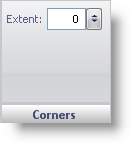

////

|metadata|
{
    "name": "wingauge-radial-gauge-corners-pane",
    "controlName": ["WinGauge"],
    "tags": ["Charting"],
    "guid": "{4BEF66E3-12FE-42D9-BDAE-499F8454F8EA}",  
    "buildFlags": [],
    "createdOn": "0001-01-01T00:00:00Z"
}
|metadata|
////

= Corners Pane

The Corners pane is used to determine the shape of the corners on your Radial gauge.

pick:[win-forms="link:{ApiPlatform}win.ultrawingauge{ApiVersion}~infragistics.ultragauge.resources.gauge~cornerextent.html[Extent]"]  -- Set this value to an integer from 0 to 100. This value determines the roundness of the corners of your Radial gauge.

== Related Topic

link:wingauge-radial-gauge.html[Radial Gauge]