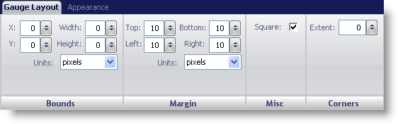
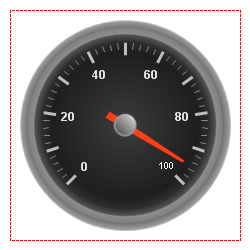

////

|metadata|
{
    "name": "wingauge-radial-gauge",
    "controlName": ["WinGauge"],
    "tags": ["Charting"],
    "guid": "{C284F0A2-B1D6-491E-8B04-3EE11587E203}",  
    "buildFlags": [],
    "createdOn": "0001-01-01T00:00:00Z"
}
|metadata|
////

= Radial Gauge

A Radial gauge displays information in a circular fashion. Although a Radial gauge can also be square, the needle markers rotate in a circular fashion. A clock is a popular example of a Radial gauge.

To customize the display of your Radial gauge you can use the Gauge Layout tab of the Properties panel. You can display this tab by either clicking Radial Gauge in the Gauge Explorer or clicking the Radial gauge in the interactive preview area.

The tab is divided into three panes:

* link:wingauge-bounds-pane.html[Bounds]
* link:wingauge-margin-pane.html[Margin]
* link:wingauge-corners-pane.html[Corners]
* link:wingauge-radial-misc-pane.html[Misc]

The following screen shot shows a Radial gauge that was created according to the layout settings specified in the above screen shot.

