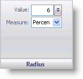

////

|metadata|
{
    "name": "wingauge-radius-pane",
    "controlName": ["WinGauge"],
    "tags": ["Charting"],
    "guid": "{C075E7F4-14BE-4C40-9F21-FFF77CA266B4}",  
    "buildFlags": [],
    "createdOn": "0001-01-01T00:00:00Z"
}
|metadata|
////

= Radius Pane

The Radius pane lets you change the size of the anchor's radius.

pick:[win-forms="link:{ApiPlatform}win.ultrawingauge{ApiVersion}~infragistics.ultragauge.resources.radialgaugeneedleanchor~radius.html[Value]"]  -- Set this value to an integer from 0 to 100 using the numeric slider. However, you can also enter a value into the text box. This value is the size of the anchor's radius.

pick:[win-forms="link:{ApiPlatform}win.ultrawingauge{ApiVersion}~infragistics.ultragauge.resources.radialgaugeneedleanchor~radiusmeasure.html[Measure]"]  -- Use the Measure drop-down list to specify the unit of measurement for the radius. The radius can be measured in pixels or as a percentage of the Radial gauge.

== Related Topic

link:wingauge-anchor-layout-tab.html[Anchor Layout Tab]