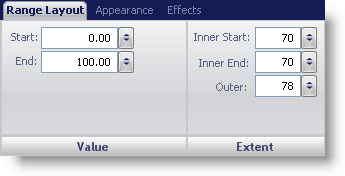
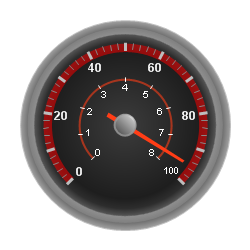

////

|metadata|
{
    "name": "wingauge-range-layout-tab",
    "controlName": ["WinGauge"],
    "tags": ["Charting"],
    "guid": "{E985A610-8EA8-4E2C-86EB-AF69432C5C45}",  
    "buildFlags": [],
    "createdOn": "0001-01-01T00:00:00Z"
}
|metadata|
////

= Range Layout Tab

The  pick:[win-forms="link:{ApiPlatform}win.ultrawingauge{ApiVersion}~infragistics.ultragauge.resources.gaugerange.html[Range]"]  property of the WinGauge control is a visual element that begins and ends at specified values on a scale. The Range property allows you to highlight specific parts of the scale. For example on a vehicle tachometer, the high RPM zones, which are usually yellow and red, indicate that the engine is running higher than the optimal load.

You can customize the range of your scale using the Range Layout tab of the Properties panel. To display this tab, click Ranges in the Gauge Explorer (Radial Gauge > Scales > Ranges).

The tab is divided into two panes:

* link:wingauge-value-pane.html[Value]
* link:wingauge-extent-pane.html[Extent]

The following screen shot shows a range that was created according to the layout settings specified in the above screen shot.

