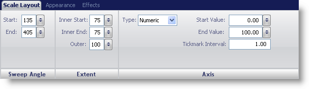
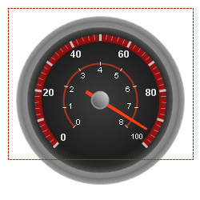

////

|metadata|
{
    "name": "wingauge-scale-layout-tab",
    "controlName": ["WinGauge"],
    "tags": ["Charting"],
    "guid": "{A6843A03-F775-4CB2-9184-739904ACE9CA}",  
    "buildFlags": [],
    "createdOn": "0001-01-01T00:00:00Z"
}
|metadata|
////

= Scale Layout Tab

The   pick:[win-forms="link:{ApiPlatform}win.ultrawingauge{ApiVersion}~infragistics.ultragauge.resources.gaugescale.html[Scale]"]  property of the WinGauge control is used to display a range of values on your Linear or Radial gauge. Adding tick marks to your gauge allows you to visually display the values of the scale on a gauge.

You can customize the scale on your gauge using the Scale Layout tab of the Properties panel. To access this tab, you can either click Scale in the Gauge Explorer (Radial\Linear Gauge > Scales) or click on the scale on your gauge in the interactive preview area.

The tab is divided into three panes:

* link:wingauge-sweep-angle-pane.html[Sweep Angle]
* link:wingauge-extent-pane.html[Extent]
* link:wingauge-axis-pane.html[Axis]

The following screen shot shows a scale that was created according to the layout settings specified in the above screen shot.

