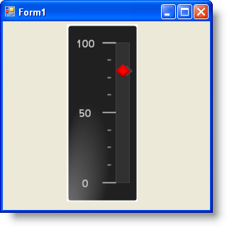

////

|metadata|
{
    "name": "wingauge-shadow-effects",
    "controlName": ["WinGauge"],
    "tags": ["Charting"],
    "guid": "{BA0DC2DF-2206-4199-9109-79B2B9465339}",  
    "buildFlags": [],
    "createdOn": "0001-01-01T00:00:00Z"
}
|metadata|
////

= Shadow Effects

You can apply various effects to the properties of your gauge. Shadow effects add depth and visually enhance your properties. For example, you can apply a drop shadow effect to an anchor to give it a 3D appearance.

The following screen shot shows an example of a Linear gauge with effects applied to the  pick:[win-forms="link:{ApiPlatform}win.ultrawingauge{ApiVersion}~infragistics.ultragauge.resources.lineargaugescale~markers.html[Markers]"]  property.

== Related Topic

link:wingauge-apply-shadow-effects.html[Apply Shadow Effects]