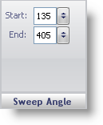

////

|metadata|
{
    "name": "wingauge-sweep-angle-pane",
    "controlName": ["WinGauge"],
    "tags": ["Charting"],
    "guid": "{CA1564AB-5694-47AA-8641-320175046EDF}",  
    "buildFlags": [],
    "createdOn": "0001-01-01T00:00:00Z"
}
|metadata|
////

= Sweep Angle Pane

The Sweep Angle pane determines the start and the end angles of the scale.

pick:[win-forms="link:{ApiPlatform}win.ultrawingauge{ApiVersion}~infragistics.ultragauge.resources.radialgaugescale~startangle.html[Start]"]  -- Set this value to a value from -999 to 999. This value determines the start angle of the scale.

pick:[win-forms="link:{ApiPlatform}win.ultrawingauge{ApiVersion}~infragistics.ultragauge.resources.radialgaugescale~endangle.html[End]"]  -- Set this value to a value from -999 to 999. This value determines the end angle of the scale.

== Related Topic

link:wingauge-scale-layout-tab.html[Scale Layout Tab]