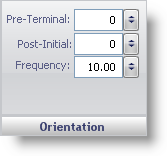

////

|metadata|
{
    "name": "wingauge-tickmark-orientation-pane",
    "controlName": ["WinGauge"],
    "tags": ["Charting"],
    "guid": "{11EB40AE-A736-425B-8A27-912E6EE0FC48}",  
    "buildFlags": [],
    "createdOn": "0001-01-01T00:00:00Z"
}
|metadata|
////

= Orientation Pane

The Orientation pane lets you set the intervals, starting point and ending point of the tick marks on your Radial or Linear gauge.

pick:[win-forms="link:{ApiPlatform}win.ultrawingauge{ApiVersion}~infragistics.ultragauge.resources.gaugescaletickmarkappearance~preterminal.html[Pre-Terminal]"]  -- Set this value to an integer from 0 to 100. This value is used to set the end value of the tick marks, rotating in a counter-clockwise direction, decreasing in intervals set in the Frequency value of the link:wingauge-formatting-pane.html[Formatting pane].

pick:[win-forms="link:{ApiPlatform}win.ultrawingauge{ApiVersion}~infragistics.ultragauge.resources.gaugescaletickmarkappearance~postinitial.html[Post-Initial]"]  -- Set this value to an integer from 0 to 100. This value determines the starting value for the tick marks, rotating in a clockwise direction increasing in intervals specified by the Frequency value in the link:wingauge-formatting-pane.html[Formatting pane].

pick:[win-forms="link:{ApiPlatform}win.ultrawingauge{ApiVersion}~infragistics.ultragauge.resources.gaugescaletickmarkappearance~frequency.html[Frequency]"]  -- Set this value to an integer from 0 to 100. This value determines the intervals between the tick marks on the scale.

== Related Topic

link:wingauge-tickmark-layout-tab.html[Tickmark Layout Tab]