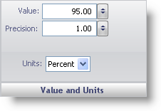

////

|metadata|
{
    "name": "wingauge-value-and-units",
    "controlName": ["WinGauge"],
    "tags": ["Charting"],
    "guid": "{22E1CAC8-02AA-42BE-B07A-FF186F7E5B43}",  
    "buildFlags": [],
    "createdOn": "0001-01-01T00:00:00Z"
}
|metadata|
////

= Value and Units

The Value and Units pane lets you set the value that at which the needle of your gauge will point.

pick:[win-forms="link:{ApiPlatform}win.ultrawingauge{ApiVersion}~infragistics.ultragauge.resources.gaugemarker~value.html[Value]"]  -- Set this value to an integer from 0 to 100. This value determines where the needle should point to on the scale.

pick:[win-forms="link:{ApiPlatform}win.ultrawingauge{ApiVersion}~infragistics.ultragauge.resources.gaugemarker~precision.html[Precision]"]  -- Set this value to a value from 0.00 to 100.00. This value is the 'rounding' number for the marker. For example, if the precision value is set to 0.5, the marker value will always snap to multiples of 0.5.

pick:[win-forms="link:{ApiPlatform}win.ultrawingauge{ApiVersion}~infragistics.ultragauge.resources.radialgaugeneedle~widthmeasure.html[Units]"]  -- This value specifies the unit of measurement for the needle. This value is not available if you are creating a needle on your Linear gauge.

== Related Topic

link:wingauge-needle-marker-layout-tab.html[Needle Marker Layout Tab]