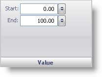

////

|metadata|
{
    "name": "wingauge-value-pane",
    "controlName": ["WinGauge"],
    "tags": ["Charting"],
    "guid": "{7BB950A5-B1CC-48FE-9413-335ADDDDBE14}",  
    "buildFlags": [],
    "createdOn": "0001-01-01T00:00:00Z"
}
|metadata|
////

= Value Pane

The Value pane lets you specify the start point and the end point of the range on the scale.

pick:[win-forms="link:{ApiPlatform}win.ultrawingauge{ApiVersion}~infragistics.ultragauge.resources.gaugerange~startvalue.html[Start]"]  -- Set this value to an integer from 0 to 360. This value sets the start point of the range on the scale.

pick:[win-forms="link:{ApiPlatform}win.ultrawingauge{ApiVersion}~infragistics.ultragauge.resources.gaugerange~endvalue.html[End]"]  -- Set this value to an integer from 0 to 360. This value sets the end point of the range on the scale.

== Related Topic

link:wingauge-range-layout-tab.html[Range Layout Tab]