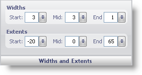

////

|metadata|
{
    "name": "wingauge-widths-and-extents-pane",
    "controlName": ["WinGauge"],
    "tags": ["Charting"],
    "guid": "{C5354902-3AE5-40A6-BA88-051B2F19E6E5}",  
    "buildFlags": [],
    "createdOn": "0001-01-01T00:00:00Z"
}
|metadata|
////

= Widths and Extents Pane

The Widths and Extents pane lets you set the shape and location of the needle marker on your Linear or Radial gauge.

Widths -- Customize the shape of your needle by specifying the following values:

*  pick:[win-forms="link:{ApiPlatform}win.ultrawingauge{ApiVersion}~infragistics.ultragauge.resources.radialgaugeneedle~startwidth.html[Start]"]  -- Set this value to an integer from 0 to 100. This value sets the width of the start point of the needle marker.
*  pick:[win-forms="link:{ApiPlatform}win.ultrawingauge{ApiVersion}~infragistics.ultragauge.resources.radialgaugeneedle~midwidth.html[Mid]"]  -- Set this value to an integer from 0 to 100. This value sets the width of the midpoint of the needle marker.
*  pick:[win-forms="link:{ApiPlatform}win.ultrawingauge{ApiVersion}~infragistics.ultragauge.resources.radialgaugeneedle~endwidth.html[End]"]  -- Set this value to an integer from 0 to 100. This value sets the width of the end of the needle marker.

Extents -- This section determines the location of the needle marker. In a Radial gauge, this position is measured from the center, and in a Linear gauge, this position is measured from the bottom of the gauge.

*  pick:[win-forms="link:{ApiPlatform}win.ultrawingauge{ApiVersion}~infragistics.ultragauge.resources.radialgaugeneedle~startextent.html[Start]"]  -- Set this value to an integer from 0 to 100. This value sets the position of the start point of the needle marker.
*  pick:[win-forms="link:{ApiPlatform}win.ultrawingauge{ApiVersion}~infragistics.ultragauge.resources.radialgaugeneedle~midextent.html[Mid]"]  -- Set this value to an integer from 0 to 100. This value sets the position of the mid-point of the needle marker.
*  pick:[win-forms="link:{ApiPlatform}win.ultrawingauge{ApiVersion}~infragistics.ultragauge.resources.radialgaugeneedle~endextent.html[End]"]  -- Set this value to an integer from 0 to 100. This value sets the position of the end point of the needle marker.

== Related Topic

link:wingauge-needle-marker-layout-tab.html[Needle Marker Layout Tab]