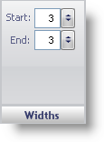

////

|metadata|
{
    "name": "wingauge-widths-pane",
    "controlName": ["WinGauge"],
    "tags": ["Charting"],
    "guid": "{A0074001-1F37-4052-A656-6B57E4C6224E}",  
    "buildFlags": [],
    "createdOn": "0001-01-01T00:00:00Z"
}
|metadata|
////

= Widths Pane

The Widths pane determines the thickness of each tick mark on your Radial or Linear gauge.

pick:[win-forms="link:{ApiPlatform}win.ultrawingauge{ApiVersion}~infragistics.ultragauge.resources.radialgaugescaletickmarkappearance~startwidth.html[Start]"]  -- Set this value to an integer from 0 to 100. This value sets the width of the start point of the tick mark.

pick:[win-forms="link:{ApiPlatform}win.ultrawingauge{ApiVersion}~infragistics.ultragauge.resources.radialgaugescaletickmarkappearance~endwidth.html[End]"]  -- Set this value to an integer from 0 to 100. This value sets the width of the end point of the tick mark.

== Related Topic

link:wingauge-tickmark-layout-tab.html[Tickmark Layout Tab]