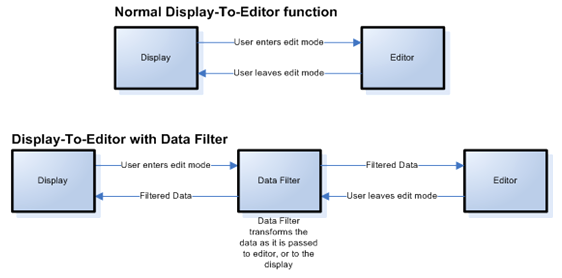

////

|metadata|
{
    "name": "wingrid-about-data-filters",
    "controlName": ["WinGrid"],
    "tags": ["Grids"],
    "guid": "{19967892-471C-45A5-9386-0268CB343D34}",  
    "buildFlags": [],
    "createdOn": "0001-01-01T00:00:00Z"
}
|metadata|
////

= About Data Filters

All embeddable editors support data filter functionality, allowing you to perform customized data translations and otherwise manipulate data's content and format as it moves between the application and the data source. You can use data filters for several typical scenarios:

* Convert or transform data from one form to another and back again without touching your data model
* Show the "Lookup" values of foreign key fields
* "Flatten Out" complex objects with nested properties

There are three points within the control that participate in the Data Filtering process:

* Owner
* Editor
* Display

These three points let you intercept data that is in transit from one of these points to the other, allowing you to transform the data however you need.

The Owner can best be described as a single object property that the control is bound to. If your bound data includes a custom business object of type Customer and a specific editor is used to represent the Customer’s first name, the Owner would be the FirstName property.

The Editor represents the actual object that is used to hold the property’s value on the control itself. When you see Editor, you can think of Numeric Editor or CheckBoxEditor or DateTimeEditor and all of the associated properties you can find on a typical editor control.

You can think of the Display as the finished product. This is the final painted and rendered version of the value that is being displayed on the user interface.

The transit points where Data can be transformed are:

* Data that moves from the Data Source to the painted and rendered screen:

** Owner to Editor
** Editor to Display

* Data that moves from the painted and rendered screen back to the Data Source:

** Display to Editor
** Editor to Owner

The illustration below shows the normal function of data as it moves between the Display and Editor modes of a cell, and then how you can insert a Data Filter into that pipeline to perform formatting actions on the data.

Data Filters provide four basic types of data conversion:

[options="header", cols="a,a"]
|====
|Conversion|Description

|Display To Editor
|For example, the string "+1" could be converted to tomorrow's date

|Editor To Display
|For example, tomorrow's date could be converted to the string "Tomorrow"

|Owner To Editor
|For example, a CustomUserAppointment could be converted to DateTime

|Editor To Owner
|For example, a DateTime could be converted to a CustomUserAppointment

|====