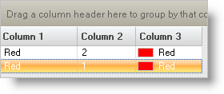

////

|metadata|
{
    "name": "wingrid-adding-rows-to-wingrid-programmatically",
    "controlName": ["WinGrid"],
    "tags": ["Grids","How Do I"],
    "guid": "{27ECEFDC-02CC-4140-A664-3F3C6924FAB4}",  
    "buildFlags": [],
    "createdOn": "0001-01-01T00:00:00Z"
}
|metadata|
////

= Adding Rows to WinGrid Programmatically

== Before you Begin

It is possible to add rows programmatically to WinGrid™ by using the AddRow method of the UltraGridBand object. The AddRow method allows you to add a row through a button click or through some other event. Keep in mind, that when the AddRow method is called, it displays the data entry row. Therefore, if you add several rows at a time, performance will greatly decrease as WinGrid will display each row individually as they are created. If you need to add more than one row programmatically, it is recommended that you add the rows directly to the DataSet. Be sure to read the final step of this walkthrough for a thorough explanation.

== What You Will Accomplish

You will create a sample DataSet and bind it to WinGrid. You will then create two WinButton's. One of these buttons will add rows to WinGrid using the AddRow method. The other button will add rows to the underlying DataSet.

== Follow these Steps

[start=1]
. *Setup your Form.*

Select the Data tab from the toolbox and double-click DataSet. A dialog box will display asking if you want to create a typed or untyped dataset. Select the Untyped dataset option and click OK.
[start=2]
. Drag an UltraGrid control from the toolbox onto the form. When the UltraGrid Designer appears, click Finish.
[start=3]
. While the UltraGrid is selected, find the DataSource property in the properties window and set it to dataSet1.
[start=4]
. Drag two buttons on the form. Change the text of one of the buttons to "Add a Row to WinGrid" and set its Name to "btnWinGrid". Assign the Text property of the other button "Add a Row to the DataSet" and set its Name property to "btnDataSet."
[start=5]
. *Add using/Imports directives*

before you start writing any code, view the code-behind and add using/Imports directives so you don't always have to type out the fully qualified name.

*In Visual Basic:*

----
Imports Infragistics.Win
Imports Infragistics.Win.UltraWinGrid
----

*In C#:*

----
using Infragistics.Win;
using Infragistics.Win.UltraWinGrid;
----

[start=6]
. *Fill the DataSet*

You will need to create a Table for the dataset with three Columns. You can do this in code in the form's Load event. To create a Load event, double-click on the header of the Form in Design view. Add the following code to the form's Load event.

*In Visual Basic:*

----
Private Sub Add_Rows_to_WinGrid_Programmatically_Load(ByVal sender As System.Object, _
  ByVal e As System.EventArgs) Handles MyBase.Load
	'Create a table that will contain three columns.
	Dim table As DataTable = New DataTable("Table")
	'Create three columns that will hold sample data.
	Dim column1 As DataColumn = New DataColumn("Column 1", GetType(System.String))
	Dim column2 As DataColumn = New DataColumn("Column 2", GetType(System.Int32))
	Dim column3 As DataColumn = New DataColumn("Column 3", GetType(System.Drawing.Color))
	'Add the three columns to the table.
	table.Columns.AddRange(New DataColumn() {column1, column2, column3})
	'Add the table to the dataset.
	Me.DataSet1.Tables.Add(table)
----

[source]
----
End Sub
----

*In C#:*

----
private void Add_Rows_to_WinGrid_Programmatically_Load(object sender, EventArgs e)
{
	//Create a table that will contain three columns.
	DataTable table = new DataTable("Table");
	//Create three columns that will hold sample data.
	DataColumn column1 = new DataColumn("Column 1", typeof(string));
	DataColumn column2 = new DataColumn("Column 2", typeof(int));
	DataColumn column3 = new DataColumn("Column 3", typeof(System.Drawing.Color));
	//Add the three columns to the table.
	table.Columns.AddRange(new DataColumn[] { column1, column2, column3 });
	//Add the table to the dataset.
	this.dataSet1.Tables.Add(table);
}
----

[start=7]
. *Create the Click event for the button that will add data using the AddRow method.*

In Design view, double-click on the button called "btnWinGrid." A Click event is generated in the code-behind. In this event, you will create an instance of the AddRow feature and add data to it. Add the following code to the Click event.

*In Visual Basic:*

----
Private Sub btnWinGrid_Click(ByVal sender As System.Object, _
  ByVal e As System.EventArgs) Handles btnWinGrid.Click
	Dim row As UltraGridRow = Me.UltraGrid1.DisplayLayout.Bands(0).AddNew()
	row.Cells(0).Value = "Red"
	row.Cells(1).Value = "1"
	row.Cells(2).Value = Color.Red
----

[source]
----
End Sub
----

*In C#:*

----
private void btnWinGrid_Click(object sender, EventArgs e)
{
	UltraGridRow row = this.ultraGrid1.DisplayLayout.Bands[0].AddNew();
	row.Cells[0].Value = "Red";
	row.Cells[1].Value = "1";
	row.Cells[2].Value = Color.Red;
}
----

[start=8]
. *Create the Click event for the button that will add data to the dataset.*

In Design view, double-click on the second button that you created. A Click even is generated in the code-behind. In this event, you will add a row to the dataset using the Add method of the Row object. Add the following code to the Click event.

*In Visual Basic:*

----
Private Sub btnDataSet_Click(ByVal sender As System.Object, _
  ByVal e As System.EventArgs) Handles btnDataSet.Click
	Me.DataSet1.Tables(0).Rows.Add(New Object() {"Red", 2, Color.Red})
----

[source]
----
End Sub
----

*In C#:*

----
private void btnDataSet_Click(object sender, EventArgs e)
{
	this.dataSet1.Tables[0].Rows.Add(new object[] { "Red", 2, Color.Red });
}
----

[start=9]
. *Run the application.*

Clicking on either of the buttons adds a row to the WinGrid. One thing to note though is that the row that is added to the DataSet appears before the row that is added using the WinGrid's AddNew method.

The process that these two methods are going through to add data is very different. When you click the first button, WinGrid displays the data entry row, inputs the data (as the end-user would), and then adds the data to the dataset. Clicking the second button adds all the data directly to the dataset and then the WinGrid updates itself. This is where performance becomes a factor. If you needed to add 100 rows and you did that through the AddRow method, you would literally see each and every row scroll by while being added to the WinGrid. Using the Add method off the System.Data.DataRowCollection object will not visually present each added row to the end user. WinGrid will only update itself when the dataset is finished adding rows.

If you'd like to experiment further, try placing the code in each of the Click events inside a FOR loop such as this:

*In Visual Basic:*

----
Dim i As Integer
For i = 0 To 98
	...
Next i
----

*In C#:*

----
for (int i=0; i<99; i++)
{
	...
}
----

Run the project again and click the first button. You will notice that it takes quite some time to add the rows using the AddRow as compared to the Add method off the System.Data.DataRowCollection. This is because the AddRow feature was designed for presentation and will show each row being added. When you click the second button, there is a slight pause and then WinGrid updates itself with the new data.