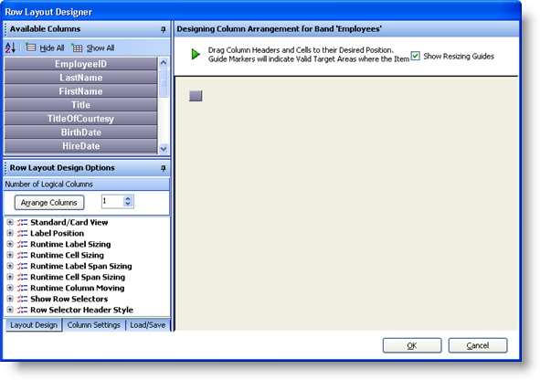
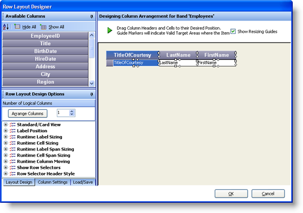
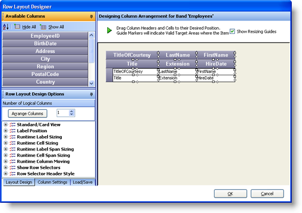
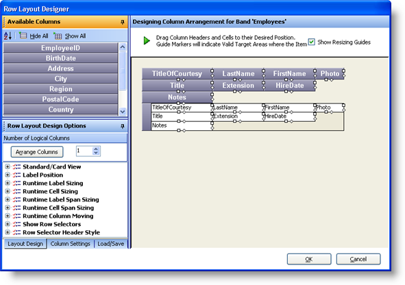
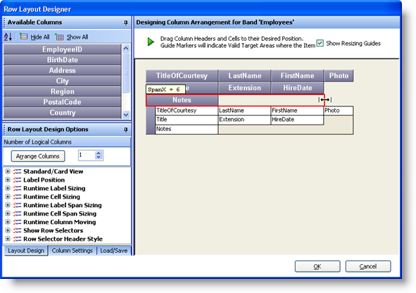
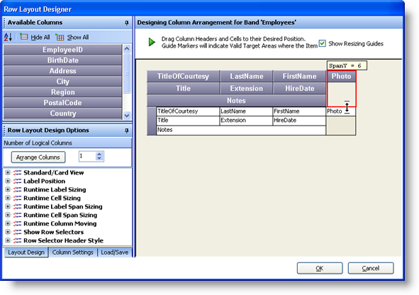
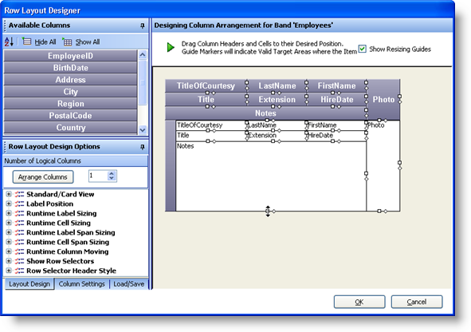
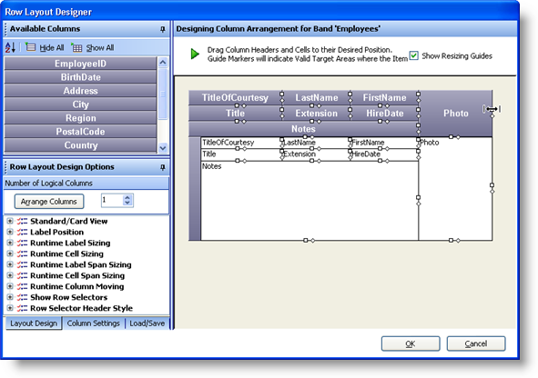
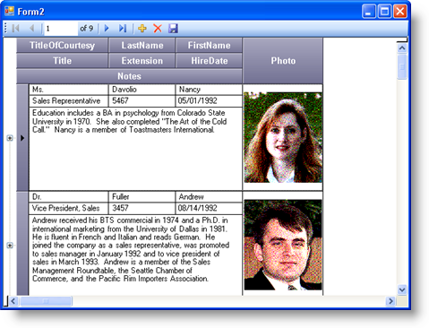

////

|metadata|
{
    "name": "wingrid-advanced-row-layouts-part-1-of-2",
    "controlName": ["WinGrid"],
    "tags": ["Application Scenarios","Grids","Layouts"],
    "guid": "{4F0821A0-7F14-4E73-8C34-F9F9D74B0800}",  
    "buildFlags": [],
    "createdOn": "0001-01-01T00:00:00Z"
}
|metadata|
////

= Advanced Row Layouts (Part 1 of 2)

The following will now elaborate on what we have learned about Row Layouts. We will now explore some more advanced concepts that will show us how to create a more advanced layout. The following steps assume you have a Windows Form along with a WinGrid bound to a design time available data source that contains an entity named Employee.

[start=1]
. Click the Start Button on the WinGrid to launch the Designer.
[start=2]
. Under the Band and Column Settings, locate and click on the Column Arrangement Overview.
[start=3]
. Select the Use Row Layout option button and then click on Design Column Arrangement Now button.
[start=4]
. Double Click all Column Headers so that they are all moved into the Available Columns area.
[start=5]
. At this point, the Row Layout Designer should look like this:

[start=6]
. Drag and Drop the TitleOfCourtesy, LastName and FirstName Column Headers onto the Design Surface as shown in the image below:

[start=7]
. Drag the Title, Extension and HireDate columns and arrange them as shown below:

[start=8]
. Next Drag the Notes and Photo columns and place them as shown below:

[start=9]
. At this point, we can now span some of these cells vertically and horizontally. Start off by locating the diamond icon located on the right hand side of the Notes column header. Click it and drag it towards the right so that the space directly underneath the Extension and HireDate columns is filled. Do not pass the boundaries of the HireDate column:

[start=10]
. Next, we will span the Photo Column header vertically. Locate the diamond icon located on the bottom of the Photo column header. Click it and drag it downward so that the remaining empty space is completely filled:

[start=11]
. The WinGrid is now almost complete. We can make some minor adjustments such as resizing the Notes Cell and the Photo Cell. Locate the Square icon located on the bottom of the Notes Cell. Click it and drag it downward until it is a decent size to allow the editing of a paragraph of text:

[start=12]
. Next, we can resize the Photo Column’s width so that the actual Image that displays in this cell will be clear and a decent size. Locate the Square icon on the right hand side of the Photo Column Header. Click it and drag it towards the right until it is a decent size to clearly show an Image:

[start=13]
. The Grid is almost ready to display the Employee data. We can now set some properties directly on the Notes Column so that the text will wrap around and fill the entire cell contents as well as show a scrollbar to scroll through lots of text when available.
[start=14]
. Click the OK button to close the Row Layout Designer.
[start=15]
. Expand the Band[0] ‘Employees’ node and click on the Columns node. This will allow us to set properties for each column.
[start=16]
. Locate the Notes column and click it to expose its properties.
[start=17]
. Locate the CellMultiLine property and set its value to True.
[start=18]
. Locate the VertScrollBar property and set its value to True.
[start=19]
. Locate the Photo column and click it to expose its properties.
[start=20]
. The Photo Column actually represents an underlying data model property that is an Image. Usually if using a DataTable that is automatically generated using Visual Studio, the Image properties are usually exposed as a Byte Array. If this Byte Array happens to be of an Image, the WinGrid can display the actual Image in its cells. We need to set a property on the Column so that the Image is shown. Locate the Style property and set it to Image or ImageWithShadow.
[start=21]
. Click the Apply button and then the OK button to close the UltraWinGrid Designer.
[start=22]
. Now we can run the application and assuming you have the code to get the Data, the resulting form should look like this:

Notice how all of the Fields are visible on the screen at the same time. At a quick glance, the end user can view all information for each entity without scrolling horizontally. Also note how the Notes Field text wraps around and it also shows a scrollbar whenever you enter edit mode and the text is larger than the cell size.

