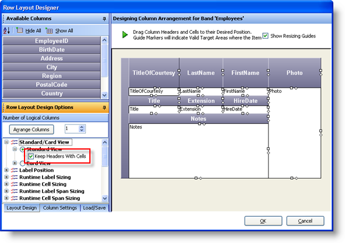
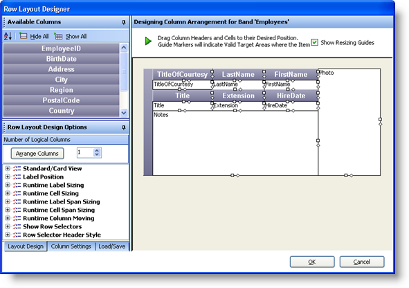
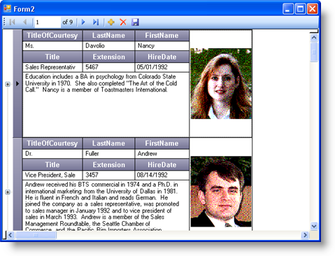

////

|metadata|
{
    "name": "wingrid-advanced-row-layouts-part-2-of-2",
    "controlName": ["WinGrid"],
    "tags": ["Application Scenarios","Grids","Layouts"],
    "guid": "{B63AF8F3-0FF3-4EA4-BFF8-1973C7F55E05}",  
    "buildFlags": [],
    "createdOn": "0001-01-01T00:00:00Z"
}
|metadata|
////

= Advanced Row Layouts (Part 2 of 2)

Now that we have seen a more advanced Row Layout, we can continue to further tweak this existing example to learn a little more about what else can be done.

[start=1]
. Launching the Row Layout Designer on this same WinGrid, locate the Row Layout Design Options area (on the bottom left hand side of the UI) and expand the Standard/Card View node. Then expand the Standard View node.
[start=2]
. Place a Check in the Keep Headers With Cells CheckBox. This will cause all of the Column Headers to be positioned directly above each of their corresponding cells:

Now that we have entered this new view, we can further adjust some settings. For example, we do not really need a column header for the Photo column. We know it is a Photo just by looking at it. We can also shrink the Column Header Height since they are now a little too tall. We can also remove the Notes column header.

[start=1]
. To get started, Click the OK Button to close the Row Layout Designer
[start=2]
. In the UltraWinGrid Designer, click and expand the Band and Column Settings node, then expand the Band[0] ‘Employees’ Node and click the Column Node. This will show all of the Columns for the Employee Band.
[start=3]
. Locate the Photo Column and click it.
[start=4]
. Locate its RowLayoutColumnInfo property and expand that as well. This property contains information that is strictly used by the Grid when we are using Row Layouts.
[start=5]
. Locate the LabelPositon property and set its value to None.
[start=6]
. Now do the same for the Notes Column. Click the Notes column, expand the RowLayoutColumnInfo property and set the LabelPosition property value also to none.
[start=7]
. Click Apply to save the settings
[start=8]
. Launch the Row Layout Designer again to review what the Grid looks like:

[start=9]
. At this point, everything looks good. Click OK to close the Row Layout Designer and then click OK to close the UltraWinGrid Designer and run the application. The Form should now look like this:

Now that we have explored the different things that can be accomplished using Row Layouts, you too will be able to use your creativity combined with the application requirements to deliver a wonderful user interface without having to spend much time to create it.

