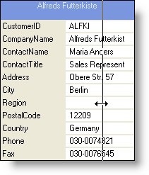

////

|metadata|
{
    "name": "wingrid-allowing-to-resize-card-labels",
    "controlName": ["WinGrid"],
    "tags": ["Grids","How Do I"],
    "guid": "{BB08EE19-1E05-4F57-BC5B-07B505002815}",  
    "buildFlags": [],
    "createdOn": "2008-10-04T16:10:17Z"
}
|metadata|
////

= Allowing to Resize Card Labels

You can set how users resize the labels and data cells within the Cards. There are two properties that control this:  pick:[win-forms="link:{ApiPlatform}win.ultrawingrid{ApiVersion}~infragistics.win.ultrawingrid.ultragridcardsettings~allowlabelsizing.html[AllowLabelSizing]"]  and  pick:[win-forms="link:{ApiPlatform}win.ultrawingrid{ApiVersion}~infragistics.win.ultrawingrid.ultragridcardsettings~allowsizing.html[AllowSizing]"] .

When set to true, AllowLabelSizing allows the end users to hover their mouse pointers over the right side of a Card Label and then click and drag to resize it.

Similar behavior occurs for AllowSizing. Once set to true, users can resize the actual data cells by clicking and dragging the right most side of a data cell.

The following code shows how to set these two properties:

*In Visual Basic:*

----
Me.UltraGrid1.DisplayLayout.Bands(0).CardSettings.AllowLabelSizing = True
Me.UltraGrid1.DisplayLayout.Bands(0).CardSettings.AllowSizing = True
----

*In C#:*

----
this.ultraGrid1.DisplayLayout.Bands[0].CardSettings.AllowLabelSizing = true;
this.ultraGrid1.DisplayLayout.Bands[0].CardSettings.AllowSizing = true;
----