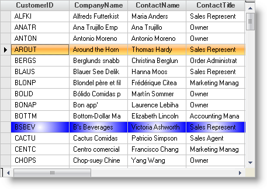

////

|metadata|
{
    "name": "wingrid-applying-a-gradient-background-to-a-row",
    "controlName": ["WinGrid"],
    "tags": ["Data Presentation","Grids","How Do I"],
    "guid": "{26C822F6-7743-4DFB-8E47-B83E79056829}",  
    "buildFlags": [],
    "createdOn": "2005-11-07T00:00:00Z"
}
|metadata|
////

= Applying a Gradient Background to a Row

The following code demonstrates how to set the background of a specific row to a gradient between two colors.

*In Visual Basic:*

----
Imports Infragistics.Win.UltraWinGrid
Imports Infragistics.Win
...
Private Sub Apply_a_Gradient_Background_To_a_Row_Load(ByVal sender As System.Object, _
  ByVal e As System.EventArgs) Handles MyBase.Load
	Dim objRow As UltraGridRow
	objRow = Me.UltraGrid1.Rows(10)
	Me.UltraGrid1.Rows(10).Appearance.BackColor2 = Color.Blue
	Me.UltraGrid1.Rows(10).Appearance.BackGradientStyle = GradientStyle.Circular
	Me.UltraGrid1.ActiveRow = objRow
End Sub
----

*In C#:*

----
using Infragistics.Win.UltraWinGrid;
using Infragistics.Win;
...
private void Apply_a_Gradient_Background_To_a_Row_Load(object sender, EventArgs e)
{
	UltraGridRow objRow = this.ultraGrid1.Rows[10];
	this.ultraGrid1.ActiveRow = objRow;
	this.ultraGrid1.Rows[10].Appearance.BackColor2 = Color.Blue;
	this.ultraGrid1.Rows[10].Appearance.BackGradientStyle = GradientStyle.Circular;
}
----

