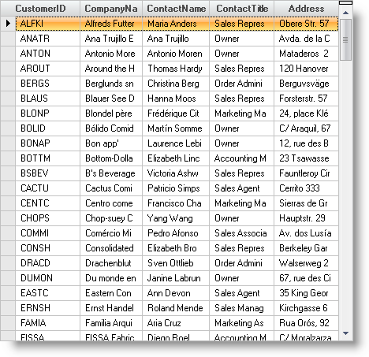

////

|metadata|
{
    "name": "wingrid-auto-sizing-columns-and-rows",
    "controlName": ["WinGrid"],
    "tags": ["Grids","How Do I"],
    "guid": "{346787C2-D2FD-422E-B7DC-3DD30B91513F}",  
    "buildFlags": [],
    "createdOn": "2005-08-09T00:00:00Z"
}
|metadata|
////

= Auto-Sizing Columns and Rows

The WinGrid™ has the ability to auto sizing the columns and rows based on the setting of the  pick:[win-forms="link:{ApiPlatform}win.ultrawingrid{ApiVersion}~infragistics.win.ultrawingrid.ultragridlayout~autofitstyle.html[AutoFitStyle]"]  property.

== Auto-fitting columns to WinGrid's width

[start=1]
. Before you start writing any code, you should place using/imports directives in your code-behind so you don't need to always type out a member's fully qualified name.

*In Visual Basic:*

----
Imports Infragistics.Win.UltraWinGrid
----

*In C#:*

----
using Infragistics.Win.UltraWinGrid;
----

[start=2]
. To automatically resize columns so they fit the width of the WinGrid set the AutoFitStyle property to  pick:[win-forms="link:{ApiPlatform}win.ultrawingrid{ApiVersion}~infragistics.win.ultrawingrid.autofitstyle.html[ResizeAllColumns]"] . This will make each column proportionally bigger or smaller so they all fit the WinGrid and eliminate the need for having a horizontal scrollbar. Also as the user resizes WinGrid, the columns will be continuously auto-resized to fit the WinGrid.

*In Visual Basic:*

----
Me.ultraGrid1.DisplayLayout.AutoFitStyle = AutoFitStyle.ResizeAllColumns
----

*In C#:*

----
this.ultraGrid1.DisplayLayout.AutoFitStyle = AutoFitStyle.ResizeAllColumns;
----

[start=3]
. You can exempt a specific column from automatically resizing by doing the following:

When Row-Layout mode is disabled - Set the  pick:[win-forms="link:{ApiPlatform}win.ultrawingrid{ApiVersion}~infragistics.win.ultrawingrid.ultragridcolumn~lockedwidth.html[LockedWidth]"]  to true.
** 

When Row-Layout mode is enabled - Set the  pick:[win-forms="link:{ApiPlatform}win.ultrawingrid{ApiVersion}~infragistics.win.ultrawingrid.rowlayoutcolumninfo~weightx.html[WeightX]"]  of all the columns that you want to resize to auto-fit to a non-zero value and leave the WeightX of the column(s) that you want to exempt from resizing.

*Related Topics*

* link:wingrid-displaying-multi-line-cells.html[Display Multi-Line Cells]
* link:wingrid-creating-multiple-row-layout-use-levels.html[Create a Multiple-Row Layout (Use Levels)]
* link:wingrid-working-with-row-layouts.html[Work with Row Layouts]