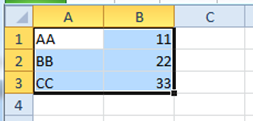
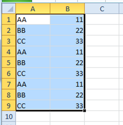
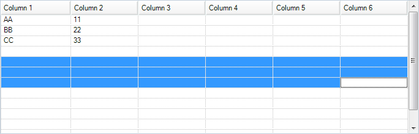
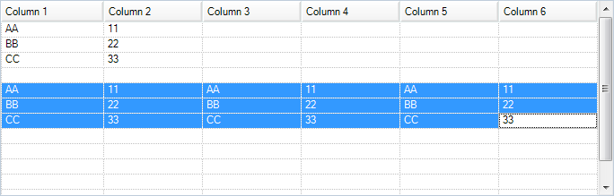

////

|metadata|
{
    "name": "wingrid-automatic-repetitive-paste-in-grids",
    "controlName": ["WinGrid"],
    "tags": ["Application Scenarios","Grids","How Do I"],
    "guid": "1d9fb7a1-a6ee-44e5-aa7c-b0bdfc6e161b",  
    "buildFlags": [],
    "createdOn": "2011-08-31T17:59:48.9555827Z"
}
|metadata|
////

= Automatic Repetitive Paste in Grids

This topic explains the WinGrid™ automatic repetitive paste functionality and provides a quick demo example of how this functionality works.

The topic is organized as follows:

* <<One,Introduction>>
* <<Two,Automatic Repetitive Paste – Conceptual Explanation>>
* <<Three,Example>>
* <<Four,Limitations>>
* <<Five,Related Topics>>

[[One]]
== Introduction

The WinGrid has basic copy/paste/undo features built-in. One of these built-in features mimics the behavior Microsoft Excel® has when pasting data to a selection of cells that is larger than the selection being copied. This behavior, called “repetitive paste”, repeats the pasted data as many times as the source (copied) selection of cells fits into the destination (paste) selection (Figure 1).

Figure 1: Selection of cells containing data that has been repetitively pasted.

[[Two]]
== Automatic Repetitive Paste – Conceptual Explanation

The WinGrid automatic repetitive paste functionality uses the size of the cell selection to determine if the selection is an exact multiple (in regards to the amount of row and column data in the clipboard). If the selection is an exact multiple, then the paste operation will repeat the same data throughout the selection as shown in Figure 1. If it isn’t, just one copy of the copied content will be pasted (normal Paste).

This behavior is exactly the same as exhibited by MS Excel.

[[Three]]
== Example

Let’s have the same data in our WinGrid as shown in Figure 1 along with clipboard operations enabled. (For information about how to turn clipboard operations on, please refer to the topic, link:wingrid-turning-on-clipboard-operations.html[Turn On Clipboard Operations].) We are going to paste it into a destination selection that is three times larger, in horizontal direction, than the area being copied. (Figure 3 below)

[start=1]
. *Drag and highlight the area cells* you want to copy.
[start=2]
. *Press Ctrl-C* to copy the values.
[start=3]
. Using another area of the grid, or another WinGrid, *drag and highlight a selection of cells that is a multiple of the previously copied cells* . For this example, if you copied 2 columns with 3 rows, you could use a selection of 6 columns and 3 rows because they are a multiple of your selection.

Figure 2: Selecting a destination the destination area for the paste operation
[start=4]
. *Press Ctrl-V* . The values will be pasted repetitively.

Figure 3: The source content as repetitively pasted into the destination selection

[[Four]]
== Limitations

While the automatic repetitive paste functionality works with an entire row of data selected through the  _Row Selector_, selecting an entire column by the  _Column Header_  does not work, because, with it, the WinGrid does not recognize any of the cells as being selected. Therefore, any paste operations occurring in the latter case will result in cell values being pasted across the active row.

[[Five]]
== Related Topics

* link:wingrid-turning-on-clipboard-operations.html[Turn On Clipboard Operations]
* link:wingrid-editing-data.html[Editing Data]