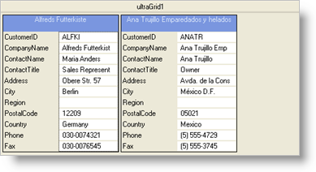
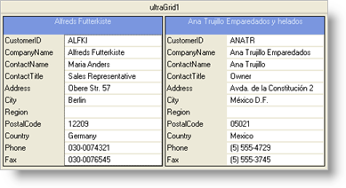

////

|metadata|
{
    "name": "wingrid-automatically-fit-cards-in-the-available-space",
    "controlName": ["WinGrid"],
    "tags": ["Grids","How Do I"],
    "guid": "{0784763D-0051-4E49-B303-46F2F48B9315}",  
    "buildFlags": [],
    "createdOn": "2008-10-04T16:10:58Z"
}
|metadata|
////

= Automatically Fit Cards in the Available Space

You can control the way cards are sized within WinGrid™ with the  pick:[win-forms="link:{ApiPlatform}win.ultrawingrid{ApiVersion}~infragistics.win.ultrawingrid.ultragridcardsettings~autofit.html[AutoFit]"]  property. Once set to True, the widths of all cards will either expand or shrink in order to completely fill the card area of WinGrid. In other words, when you enable AutoFit, you will not see any card area to the right of the cards because the cards will have expanded to completely cover this. If you have a card column that is not complete (i.e., the end of the records) then you will be able to see the empty Card area.

The following code automatically fits cards in the available space.

AutoFit = False

AutoFit = True

*In Visual Basic:*

----
Me.UltraGrid1.DisplayLayout.Bands(0).CardSettings.AutoFit = True
----

*In C#:*

----
this.ultraGrid1.DisplayLayout.Bands[0].CardSettings.AutoFit = true;
----