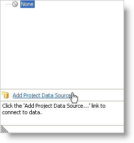
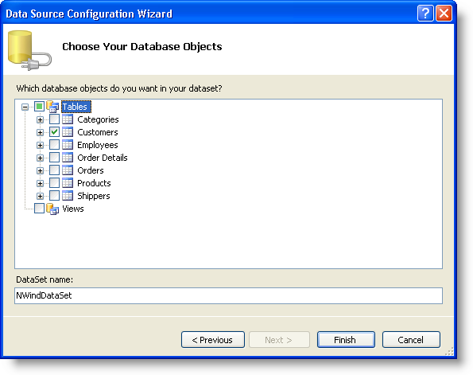

////

|metadata|
{
    "name": "wingrid-binding-wingrid-to-a-flat-data-source-clr2",
    "controlName": ["WinGrid"],
    "tags": ["Grids","How Do I","Sample Data Source"],
    "guid": "{DC7A65CA-988C-4698-882B-511F4C2A9D49}",  
    "buildFlags": ["win-forms"],
    "createdOn": "0001-01-01T00:00:00Z"
}
|metadata|
////

= Binding WinGrid to a Flat Data Source

This topic is designed to get you up and running as quickly as possible by describing the minimum basic procedure for adding the WinGrid™ to a form in Visual Studio .NET. This procedure shows you how to add the WinGrid control to a Visual Studio .NET project and bind it to a flat data source.

*To bind the WinGrid control to a flat data source:*

[start=1]
. Create a new Windows Application.
[start=2]
. Select the UltraGrid control in your toolbox and draw the control on the form. The UltraGrid Designer displays. Click Finish to close the dialog box.
[start=3]
. In the Properties window, select the WinGrid's DataSource property to display the drop-down list. In the drop-down list, click the "Add Project Data Source..." link.

[start=4]
. The Data Source Configuration Wizard appears. This wizard will aid you in connecting to a Database, Web Service, or Object. Select Database and click Next.
[start=5]
. In the Choose Your Data Connection dialog box, click New Connection. The Add Connection dialog box appears, which will allow you to navigate out to the location of your database. For this example, we will be using the Northwind database (NWind.mdb), which is available as part of the Infragistics Professional SDK install. By default, the NWind.mdb file is located in the following installation folder, depending on your operating system:

** Windows 7 -- C:\Users\Public\Documents\Infragistics\20{ProductVersion}\Windows Forms\Samples\Legacy\Data
** XP -- C:\Documents and Settings\All Users\Documents\Infragistics\20{ProductVersion}\Windows Forms\Samples\Legacy\Data
** Vista -- C:\Users\Public\Documents\Infragistics\20{ProductVersion}\Windows Forms\Samples\Legacy\Data

Click Browse... to navigate out to the installation path, and select the NWind.mdb file. The Add Connection dialog box should look similar to the following. When you have the connection established, click OK.

image::images/WinGrid_Bind_WinGrid_to_a_Flat_Data_Source_CLR2_02.png[Add connection dialog box]

[start=6]
. In the Choose Your Data Connection dialog box, click Next. A message box will appear explaining that the data file you have chosen is not in the current project, and gives you the option to copy the data file to your project. Click Yes.
[start=7]
. The next dialog wants to know if you wish to save your connection string used to access the data file in your application configuration file. Click Yes, as we are only connecting to the NWind.mdb file, so security isn't an issue here.
[start=8]
. In the Choose Your Database Objects dialog box, expand the Tables node and select the Customers table. Then, click Finish.

[start=9]
. A dataset, BindingSource, and TableAdapter will be generated and added as components for your form. WinGrid also will show the columns that will be shown when WinGrid is rendered.
[start=10]
. Go to your code-behind file, and you will see the form's Load event has been wired, and the following code is inside the event. This code fills the dataset using the TableAdapter that was generated.

*In Visual Basic:*

----
Me.CustomersTableAdapter.Fill(Me.NWindDataSet2.Customers)
----

*In C#:*

----
this.customersTableAdapter.Fill(this.nWindDataSet2.Customers);
----

[start=11]
. Run the application. You will see the WinGrid control on the form filled with the data from the Customers table.