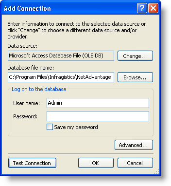

////

|metadata|
{
    "name": "wingrid-binding-wingrid-to-a-hierarchical-data-source-clr2",
    "controlName": ["WinGrid"],
    "tags": ["Grids","How Do I","Sample Data Source"],
    "guid": "{7E801D10-FA96-401C-8FFE-5B89D97D223A}",  
    "buildFlags": ["win-forms"],
    "createdOn": "0001-01-01T00:00:00Z"
}
|metadata|
////

= Binding WinGrid to a Hierarchical Data Source

This topic is designed to get you up and running as quickly as possible by describing the minimum basic procedure for adding the WinGrid™ to a form in Visual Studio .NET. This procedure shows you how to add the WinGrid control to a Visual Studio .NET project and bind it to a hierarchical data source.

== To bind the WinGrid control to a hierarchical data source:

[start=1]
. Create a new Windows Application.
[start=2]
. Select the UltraGrid control in your toolbox and draw the control on the form. The UltraGrid Designer displays. Click Finish to close the dialog box.
[start=3]
. In the Properties window, select the WinGrid's DataSource property to display the drop-down list. In the drop-down list, click the "Add Project Data Source..." link.

image::images/WinGrid_Bind_WinGrid_to_a_Flat_Data_Source_CLR2_01.png[datasource add project data source drop down]

[start=4]
. The Data Source Configuration Wizard will appear. This wizard will aid you in connecting to a Database, Web Service, or Object. Select Database and click Next.
[start=5]
. Select the New Connection button, in the "Chooser Your Data Connection" dialog. This will cause the Add Connection dialog to appear which will allow you to navigate out to the location of your database. For this example, we will be using the Northwind database (NWind.mdb), which is available as part of the Infragistics Professional SDK install. By default, the NWind.mdb file is located in the following installation folder, depending on your operating system:

** XP -- C:\Documents and Settings\All Users\Documents\Infragistics\20{ProductVersion}\Windows Forms\Samples\Legacy\Data
** Vista -- C:\Users\Public\Documents\Infragistics\20{ProductVersion}\Windows Forms\Samples\Legacy\Data

Click Browse... to navigate out to the installation path, and select the NWind.mdb file. The Add Connection dialog box should look similar to the following. When you have the connection established, click OK.

[start=6]
. In the "Choose Your Data Connection" dialog select Next. A dialog will appear saying that the data file you have chosen is not in the current project, and gives you the option to copy the data file to your project. Select Yes.
[start=7]
. The next dialog wants to know if you wish to save your connection string used to access the data file in your application configuration file. Select Yes, as we are only connecting to the Northwind.mdb file, so security isn't an issue here.
[start=8]
. In the "Choose Your Database Objects" dialog, expand the Tables node and select the Customers and Orders table. Select Finish once you have made this selection.

[start=9]
. With this done, go back to the DataSource property and drop-down the dialog again, and expand the Other Data Source section that appears now, and expand down and select the Customers table associated with the NWindDataSet.

[start=10]
. A dataset, BindingSource, and TableAdapter will be generated and added as components for your form. The WinGrid also will show the columns that will be shown when the WinGrid is rendered.
[start=11]
. Open the XSD file that's associated with the dataset, by double clicking it in the Solution Explorer. In the designer for the XSD, right click on the Customers Table and select Add, then Relation off the sub-menu. The Relation dialog will appear. Select the Customers table as the parent table and the Orders table as the child table. Your relation dialog should now look similar to the following screen shot.

image::images/WinGrid_Bind_WinGrid_to_a_Hierarchical_Data_Source_CLR2_03.png[relation dialog box]

[start=12]
. Select OK on the Relation dialog, and you will see the XSD update with a relation line between the two tables. If you build your project, and go back to your form with the WinGrid on it you will notice that the WinGrid has already picked up the relationship between the two tables.
[start=13]
. In your toolbox under the form specific components find the ordersTableAdapter and drag it onto the form. This adapter is need, along with the customersTableAdapter already on the form, to fill the data set with the data.
[start=14]
. If you go to your code-behind file you will see the form's Load event has been wired and the customersTableAdapter is already setup to fill the Customers table in the data set. Add the following line of code to fill the Orders table in the data set.

*In Visual Basic:*

----
Me.OrdersTableAdapter1.Fill(Me.NWindDataSet.Orders)
----

*In C#:*

----
this.ordersTableAdapter1.Fill(this.nWindDataSet.Orders);
----

[start=15]
. Run the application. You will see the WinGrid control on the form filled with the data from the Customers table, and if you expand a row you will see the associating customer's data from the Orders table.