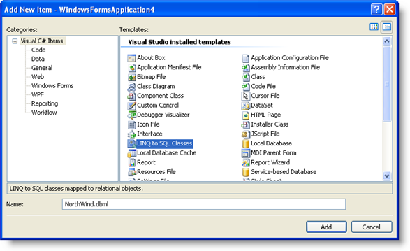

////

|metadata|
{
    "name": "wingrid-binding-wingrid-to-data-using-linq-to-sql",
    "controlName": ["WinGrid"],
    "tags": ["Application Scenarios","Grids","Sample Data Source"],
    "guid": "{9C2F503E-CB13-43FE-86EE-8880C664F1F7}",  
    "buildFlags": [],
    "createdOn": "0001-01-01T00:00:00Z"
}
|metadata|
////

= Binding WinGrid to Data Using LINQ to SQL

The .NET Language Integrated Query (LINQ) is a querying programming model that can be used with a data source.

You can use LINQ within your programming language, such as C#, to retrieve data and easily manipulate the results. LINQ to SQL is an object relational model implementation that allows you to model a relational database using .NET classes.

This topic will walk you through the process of binding your WinGrid to data using LINQ to SQL.

*Before You Begin*

Visual Studio 2008 should be installed on your machine.

*What You Will Accomplish*

This topic will show you how to bind your WinGrid control to data using the LINQ to SQL technology available with Visual Studio 2008.

*Follow these Steps*

[start=1]
. From the toolbox, drag the UltraGrid control to your form.
[start=2]
. From the Quick Start Designer, click Finish.
[start=3]
. From the Data Sources tab, select Add New Data Source...

[start=4]
. The Data Source Configuration Wizard appears.
[start=5]
. Select Database, click Next.

[start=6]
. In the Choose Your Data Connection dialog box,click New Connection. The Add Connection dialog box appears. To use the LINQ to SQL feature, you must use an SQL Server database.
[start=7]
. Change the Data Source to Microsoft SQL Server Database File.
[start=8]
. Browse to your SQL Server database.
[start=9]
. Click OK.

[start=10]
. In the Save the Connection String to the Application Configuration File, click Next.
[start=11]
. In the message box that appears, click Yes.

image::images/Grid_LINQ_to_SQL_05.png[make data local to project]

[start=12]
. Select the Tables node, then click Finish.
[start=13]
. On the Project menu, click Add New Item...
[start=14]
. In the Add New Item Dialog box, select LINQ to SQL Classes from the Templates window.
[start=15]
. Set Name to NorthWind.dbml

[start=16]
. Drag the following item from the Server Explorer on to the design surface:

** Product
** Category

[start=17]
. On the File menu, click Save. This will persist the .NET classes that represent the entities and database relationships that you created.
[start=18]
. In the Form1_Load event enter the following code:

*In Visual Basic:*

----
'Create an instance of the NorthWindDataContext
Dim db As New NorthWindDataContext 
'Select all products in the database where the category name is Beverages 
Dim products = From p In db.Products _ 
    Where p.Category.CategoryName = "Beverages" _
    Select New With {p.ProductID, p.ProductName}  
'Bind WinGrid to the results
Me.UltraGrid1.DataSource = products
----

*In C#:*

----
//Create an instance of the NorthWindDataContext 
NorthWindDataContext db = new NorthWindDataContext(); 
//Select all products in the database where the category name is Beverages 
var products = from p in db.Products 
where p.Category.CategoryName == "Beverages" 
select new
{
  Id = p.ProductId,
  Name = p.ProductName
};
//Bind WinGrid to the results
this.ultraGrid1.DataSource = products;
----