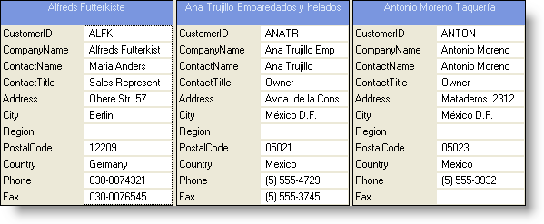
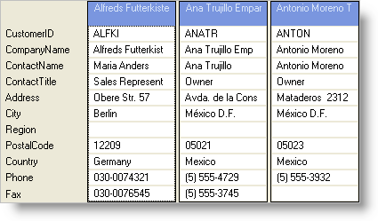
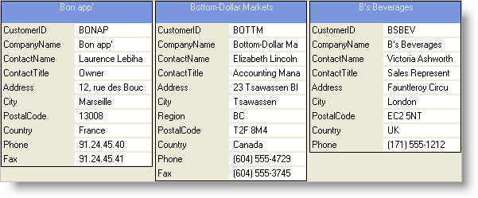
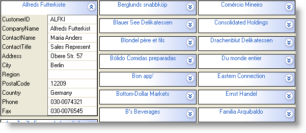

////

|metadata|
{
    "name": "wingrid-changing-card-view-style",
    "controlName": ["WinGrid"],
    "tags": ["Grids","Layouts"],
    "guid": "{1C7C8B86-58E1-4AE4-BE74-A54319D96DB9}",  
    "buildFlags": [],
    "createdOn": "2008-10-04T16:09:02Z"
}
|metadata|
////

= Changing Card View Style

Card View can be set up to display your data in several different variations. The display can be customized through the  pick:[win-forms="link:{ApiPlatform}win.ultrawingrid{ApiVersion}~infragistics.win.ultrawingrid.ultragridcardsettings~style.html[Style]"]  property. Setting the Style property to one of the four following values exposed by the  pick:[win-forms="link:{ApiPlatform}win.ultrawingrid{ApiVersion}~infragistics.win.ultrawingrid.cardstyle.html[CardStyle]"]  enumeration causes a different look and behavior to take place:

.Note
[NOTE]
====
If you have your WinGrid™ configured to use link:wingrid-row-layouts.html[Row Layouts], some of these Styles may not apply and will simply be ignored by the Grid.
====

* *Standard Labels* -- Allows all visible columns to be shown and each Card will have its own set of labels set to the left of the data cells. Each Card will be the same size in relation to each other.

* *Merged Labels* -- Causes only one set of column headers or field captions to be shown on the left most part of the grid. This allows for more Cards to be visible on the screen without having to waste real estate on repeating the labels for all cards in the Grid.

* *Variable Height* -- Changes the display so that only cells that contain data are visible. In other words, each Card gets created so that any cells that do not have any data will not be included in the display. This means that each card can be a different size than each other. This is all based on the presence of data in each record. Care should be taken to ensure that if you are allowing data entry using this configuration, users will not be able to access the fields that are not shown due to this intended design behavior.

* *Compressed Mode* -- Causes all Cards to be rolled up into a single line that is actually the Card’s Caption. Rather than consuming the space that an entire card can take up, each card initializes in a compressed state and the Caption is normally set to show a field that makes sense to the end user. Once the user identifies a record of interest, they click on the “Expand” icon on the compressed card so that the card becomes “Expanded” thus revealing all columns and details.

Use the following code to set WinGrid's card view Style to StandardLabels:

*In Visual Basic:*

----
Me.UltraGrid1.DisplayLayout.Bands(0).CardSettings.Style = _ 
   Infragistics.Win.UltraWinGrid.CardStyle.StandardLabels
----

*In C#:*

----
this.ultraGrid1.DisplayLayout.Bands[0].CardSettings.Style = 
   Infragistics.Win.UltraWinGrid.CardStyle.StandardLabels;
----