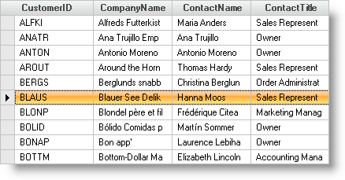

////

|metadata|
{
    "name": "wingrid-changing-the-active-row",
    "controlName": ["WinGrid"],
    "tags": ["Grids","How Do I","Tips and Tricks"],
    "guid": "{6D7FB78D-8C23-48FE-AF5D-08BAC449A428}",  
    "buildFlags": [],
    "createdOn": "2005-11-07T00:00:00Z"
}
|metadata|
////

= Changing the Active Row

When your end user opens a form with your WinGrid™ on it, you may want the active row in the grid to be a specific row, and not the first row in the grid. The following example code shows how change the *ActiveRow* of the WinGrid when the form loads.

*In Visual Basic:*

----
Imports Infragistics.Win.UltraWinGrid
...
Private Sub Change_the_Active_Row_Load(ByVal sender As System.Object, _
  ByVal e As System.EventArgs) Handles MyBase.Load
	Dim objRow As UltraGridRow = Me.UltraGrid1.Rows(5)
	Me.UltraGrid1.ActiveRow = objRow
End Sub
----

*In C#:*

----
using Infragistics.Win.UltraWinGrid;
...
private void Change_the_Active_Row_Load(object sender, EventArgs e)
{
	UltraGridRow objRow = this.ultraGrid1.Rows[5];
	this.ultraGrid1.ActiveRow = objRow;
}
----

When you use this code along with the data bound grid resulting from the link:wingrid-binding-wingrid-to-a-flat-data-source-clr2.html[Bind WinGrid to a Flat Data Source] topic, you will see something similar to the following.

