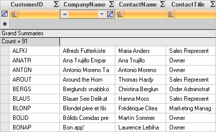

////

|metadata|
{
    "name": "wingrid-changing-the-display-order-of-fixed-rows",
    "controlName": ["WinGrid"],
    "tags": ["Grids","How Do I","Templating"],
    "guid": "{4999DB09-98C4-4F16-A2C5-C759C02FC055}",  
    "buildFlags": [],
    "createdOn": "2005-11-07T00:00:00Z"
}
|metadata|
////

= Changing the Display Order of Fixed Rows

You can control the order in which the Fixed Template Add Row, Fixed Filter Row, and Fixed Summary Footer Rows are displayed. By default, these rows will be displayed in the following order:

[start=1]
. Fixed Summary Row
[start=2]
. Fixed Template Add Row
[start=3]
. Fixed Filter Row

If this arrangement does not suit your needs, you can specify the order in which they should be displayed by setting the corresponding Sequence property for each type of row. The Sequence properties are in the  pick:[win-forms="link:{ApiPlatform}win.ultrawingrid{ApiVersion}~infragistics.win.ultrawingrid.ultragridoverride.html[UltraGridOverride]"]  class so that they can be given a default value on the  pick:[win-forms="link:{ApiPlatform}win.ultrawingrid{ApiVersion}~infragistics.win.ultrawingrid.ultragridlayout.html[DisplayLayout's]"]  Override object. Each band can have its own values for these properties by using the  pick:[win-forms="link:{ApiPlatform}win.ultrawingrid{ApiVersion}~infragistics.win.ultrawingrid.ultragridband.html[UltraGridBand's]"]  Override object.

The Sequence property with the lowest value will have its associated row type displayed above the others. The default value for the Sequence properties is -1, so make sure that you set these properties to values greater than or equal to 0.

== To change the display order of fixed rows:

[start=1]
. Before you start writing any code, you should place using/imports directives in your code-behind so you don't need to always type out a member's fully qualified name.

*In Visual Basic:*

----
Imports Infragistics.Win
Imports Infragistics.Win.UltraWinGrid
----

*In C#:*

----
using Infragistics.Win;
using Infragistics.Win.UltraWinGrid;
----

[start=2]
. To change the relative position of Fixed Template Add Rows, set the  pick:[win-forms="link:{ApiPlatform}win.ultrawingrid{ApiVersion}~infragistics.win.ultrawingrid.ultragridoverride~sequencefixedaddrow.html[SequenceFixedAddRow]"]  property.

*In Visual Basic:*

----
Me.UltraGrid1.DisplayLayout.Override.AllowAddNew = AllowAddNew.TemplateOnTop
Me.UltraGrid1.DisplayLayout.Override.SequenceFixedAddRow = 2
----

*In C#:*

----
this.ultraGrid1.DisplayLayout.Override.AllowAddNew = AllowAddNew.TemplateOnTop;
this.ultraGrid1.DisplayLayout.Override.SequenceFixedAddRow = 2;
----

[start=3]
. To change the relative position of Fixed Filter Rows, set the  pick:[win-forms="link:{ApiPlatform}win.ultrawingrid{ApiVersion}~infragistics.win.ultrawingrid.ultragridoverride~sequencefilterrow.html[SequenceFilterRow]"]  property.

*In Visual Basic:*

----
Me.UltraGrid1.DisplayLayout.Override.AllowRowFiltering = DefaultableBoolean.True
Me.UltraGrid1.DisplayLayout.Override.FilterUIType = FilterUIType.FilterRow
Me.UltraGrid1.DisplayLayout.Override.SequenceFilterRow = 1
----

*In C#:*

----
this.ultraGrid1.DisplayLayout.Override.AllowRowFiltering = DefaultableBoolean.True;
this.ultraGrid1.DisplayLayout.Override.FilterUIType = FilterUIType.FilterRow;
this.ultraGrid1.DisplayLayout.Override.SequenceFilterRow = 1;
----

[start=4]
. To change the relative position of Fixed Summary Footer Rows, set the  pick:[win-forms="link:{ApiPlatform}win.ultrawingrid{ApiVersion}~infragistics.win.ultrawingrid.ultragridoverride~sequencefilterrow.html[SequenceSummaryRow]"]  property.

*In Visual Basic:*

----
Me.UltraGrid1.DisplayLayout.Override.AllowRowSummaries = AllowRowSummaries.True
Me.UltraGrid1.DisplayLayout.Override.SummaryDisplayArea = SummaryDisplayAreas.Top
Me.UltraGrid1.DisplayLayout.Override.SequenceSummaryRow = 3
----

*In C#:*

----
this.ultraGrid1.DisplayLayout.Override.AllowRowSummaries = AllowRowSummaries.True;
this.ultraGrid1.DisplayLayout.Override.SummaryDisplayArea = SummaryDisplayAreas.Top;
this.ultraGrid1.DisplayLayout.Override.SequenceSummaryRow = 3;
----

[start=5]
. The following screen shot shows what a grid looks like with these settings. As you see the filter row is the first row, followed by the add new row template, and finally when we make a summary that row is displayed last.

