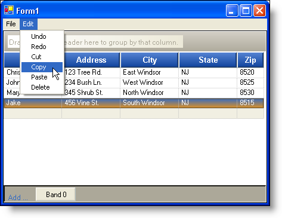
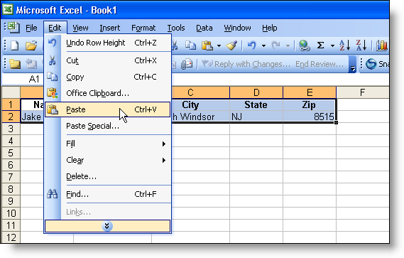

////

|metadata|
{
    "name": "wingrid-clipboard-support-for-wingrid-whats-new-2006-1",
    "controlName": [],
    "tags": [],
    "guid": "{FF1DC05C-24A6-405F-94A9-A0D2D128579B}",  
    "buildFlags": [],
    "createdOn": "0001-01-01T00:00:00Z"
}
|metadata|
////

= Clipboard Support for WinGrid

Considering that Copy and Paste are two of the most commonly used functions in word processing and text editing applications, we have now given WinGrid™ clipboard functionality. In addition to clipboard support within the WinGrid control itself, WinGrid now provides clipboard support with Microsoft® Excel®. You can now Copy, Paste, and Cut, items to and from the WinGrid. We also offer additional support for Delete, Undo, and Redo within the WinGrid. Default key action mappings are also set up that mimic the standard shortcut keys (e.g. Ctrl-C for Copy, Ctrl-V for Paste). With the WinGrid control, you can copy an individual cell or several cells from WinGrid into Excel or any other spreadsheet program that supports tab-separated cell values. Simply setting the  pick:[win-forms="link:{ApiPlatform}win.ultrawingrid{ApiVersion}~infragistics.win.ultrawingrid.ultragridoverride~allowmulticelloperations.html[AllowMultiCellOperations]"]  property of WinGrid's Override class to All will allow end users to copy and paste through the default key action mappings.

== Related Topics

link:wingrid-creating-edit-menu-with-clipboard-operations-for-wingrid.html[Creating an Edit Menu with Clipboard Operations for the WinGrid]

link:wingrid-turning-on-clipboard-operations.html[Turn On Clipboard Operations]