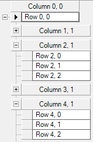

////

|metadata|
{
    "name": "wingrid-collapsible-child-bands",
    "controlName": [],
    "tags": [],
    "guid": "dd9e30ca-dde0-4b75-a3d3-475f271d86c4",  
    "buildFlags": [],
    "createdOn": "2016-03-12T19:17:11.1150212Z"
}
|metadata|
////

= Collapsible Child Bands

The UltraGrid has the ability to show ExpansionIndicators at the header of each child band. This improves the user’s ability to navigate between sibling bands with large data sets within the same parent band.

The following screenshot demonstrates a child band collapsed, allowing for easier navigation to sibling bands and reduction of information clutter.

== Enable Expansion Indicators on Child Bands

It is best to set layout properties through the link:{ApiPlatform}win.ultrawingrid{ApiVersion}~infragistics.win.ultrawingrid.ultragrid~initializelayout_ev.html[UltraGrid.InitializeLayout] event to ensure that the layout is persisted whenever data is bound to the grid.

[start=1]
. Create a WinGrid bound to a hierarchical data source with sibling child bands.
[start=2]
. Set the link:{ApiPlatform}win.ultrawingrid{ApiVersion}~infragistics.win.ultrawingrid.ultragridlayout~bandexpansionindicators.html[Layout.BandExpansionIndicators] property to link:{ApiPlatform}win.ultrawingrid{ApiVersion}~infragistics.win.ultrawingrid.bandexpansionindicators.html[ShowOnChildBand].

The following code snippet demonstrates how to set the property through an InitializeLayout event handler.

*In Visual Basic:*

[source,vb]
----
 Private Sub UltraGrid1_IniializeLayout(sender As Object, e As InitializeLayoutEventArgs)
        e.Layout.BandExpansionIndicators = BandExpansionIndicators.ShowOnChildBands
    End Sub
----

*In C#:*

[source,csharp]
----
 private void UltraGrid1_IniializeLayout(object sender, InitializeLayoutEventArgs e)
        {
            e.Layout.BandExpansionIndicators = BandExpansionIndicators.ShowOnChildBands;
        }
----