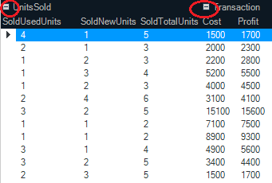
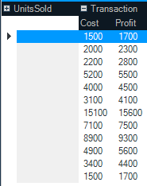
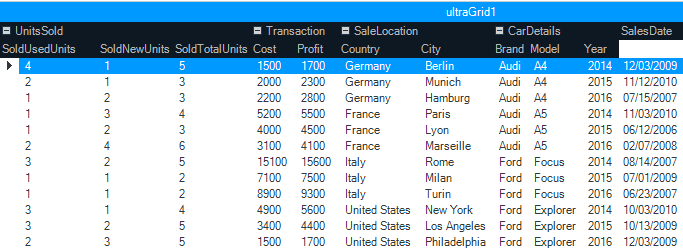

////

|metadata|
{
    "name": "wingrid-collapsing-column-groups",
    "controlName": [],
    "tags": [],
    "guid": "3ebd5c8d-553b-49d4-a3dd-cb1156e68f1a",  
    "buildFlags": [],
    "createdOn": "2016-03-11T22:27:30.6013683Z"
}
|metadata|
////

= Collapsing Column Groups

The UltraGridGroups collection allows you to hide all columns assigned to them. This improves the readability of your grid by allowing users to quickly prioritize information most relevant to them.

The following screenshot demonstrates the UltraGrid control with expansion indicators on the column groups.

The following screenshot demonstrates the UltraGrid control with the UnitsSold group collapsed.

== Enable Expansion Indicator

.Note
[NOTE]
====
Ensure grouping is enabled on the grid first. Refer to the link:wingrid-enabling-grouping.html[Enabling Grouping] topic for more information.
====

Within the link:{ApiPlatform}win.ultrawingrid{ApiVersion}~infragistics.win.ultrawingrid.ultragrid~initializelayout_ev.html[InitializeLayout] event handler, set the Grid’s link:{ApiPlatform}win.ultrawingrid{ApiVersion}~infragistics.win.ultrawingrid.ultragridoverride~allowgroupcollapsing.html[AllowGroupCollapsing] property to true, as demonstrated in the following code snippet.

*In Visual Basic:*

[source,vb]
----
Private Sub ultraGrid1_InitializeLayout(sender As Object, e As InitializeLayoutEventArgs)
      e.Layout.Override.AllowGroupCollapsing = Win.DefaultableBoolean.[True]
End Sub
----

*In C#:*

[source,csharp]
----
private void ultraGrid1_InitializeLayout(object sender, InitializeLayoutEventArgs e)
{
    e.Layout.Override.AllowGroupCollapsing = Win.DefaultableBoolean.True;
}
----

The following screenshot demonstrates the UltraGrid control with the expansion indicators displayed to the left of the groups:

*Related Topics*

* link:wingrid-grouping-columns-in-row-layout-using-code.html[Grouping Columns in Row Layout using Code]
* link:wingrid-grouping-columns-in-row-layout-mode-using-the-designer.html[Grouping Columns in Row Layout Mode using the Designer]