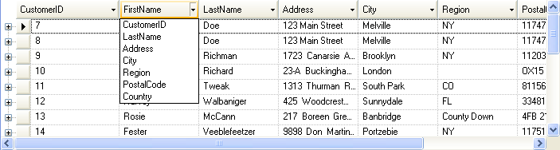

////

|metadata|
{
    "name": "wingrid-column-swapping-in-rowlayout-whats-new-2005-3",
    "controlName": [],
    "tags": [],
    "guid": "{9FD09438-A082-4D87-BCB4-D4E26809E2D9}",  
    "buildFlags": [],
    "createdOn": "0001-01-01T00:00:00Z"
}
|metadata|
////

= Column Swapping in RowLayout

Column swapping functionality is enabled by setting the  pick:[win-forms="link:infragistics4.win.ultrawingrid.v{ProductVersion}~infragistics.win.ultrawingrid.ultragridoverride~allowcolswapping.html[AllowColSwapping]"]  property to WithinBand or WithinGroup. When enabled, a drop down arrow is shown in each column header. When this drop down arrow is clicked upon, a list of columns is displayed. Selecting a column from the list will swap the current column (the column header whose swap drop down was clicked upon) with the column selected from the drop down list. The positions of the columns will be switched.

Before Infragistics Windows Forms 2005 Volume 3, the column swapping functionality only worked in non-row-layout mode. Infragistics Windows Forms 2005 Volume 3 implements this functionality in Row-Layout mode. No new properties were needed since the existing AllowColumnSwapping property is sufficient. Also this doesn't change the default behavior since AllowColumnSwapping is resolved NotAllowed by default.

== Related Topic:

link:wingrid-moving-swapping-columns.html[Move and Swap Columns]