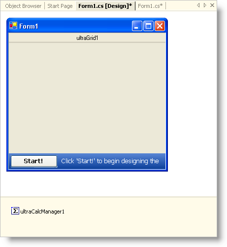
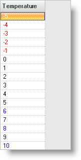

////

|metadata|
{
    "name": "wingrid-combining-multiple-conditions",
    "controlName": ["WinGrid"],
    "tags": ["Grids"],
    "guid": "{947DC884-0520-4F1D-BD0B-7814E364C451}",  
    "buildFlags": [],
    "createdOn": "0001-01-01T00:00:00Z"
}
|metadata|
////

= Combining Multiple Conditions

== Before You Begin

For the most part, comparing a cell's value to a single condition will be good enough for most situations. However, if you need to test some cells against one condition, and other cells against another separate condition, you will need to combine these conditions. For example, you may need to test a WinGrid™ column for lows and highs. If a number is under 0, change the ForeColor to Red, if the number is 5 or above, change the ForeColor to blue.

== What You Will Accomplish

In order to accomplish the above-mentioned scenario, you would need to create two conditions. For this topic, we'll use Operator conditions as you don't need to customize them much. Once you create your conditions (one to test the low bounds, another to test the high bounds), you will create a  pick:[win-forms="link:{ApiPlatform}win{ApiVersion}~infragistics.win.conditionvalueappearance.html[ConditionValueAppearance]"]  object and add both conditions, with matching appearances, to the ConditionValueAppearance object. The only thing left to do is set that ConditionValueAppearance object to the Column's  pick:[win-forms="link:{ApiPlatform}win.ultrawingrid{ApiVersion}~infragistics.win.ultrawingrid.ultragridcolumn~valuebasedappearance.html[ValueBasedAppearance]"]  property.

== Follow These Steps

[start=1]
. *Set up your form.*

.. Drag a WinGrid control from the Toolbox onto the form.
.. Set its Dock property to Fill.
.. Find the WinCalcManager component in the Toolbox and double-click it. The WinCalcManager component is now added to the component tray.

[start=2]
. Before you write any code, you should place using/Imports directives in the code-behind so you don't have to always use a member's fully qualified name.

*In Visual Basic:*

----
Imports System.Globalization
Imports Infragistics.Win
----

*In C#:*

----
using System.Globalization;
using Infragistics.Win;
----

[start=3]
. *Create the data for WinGrid*

The following code will create one column of data for WinGrid to use. Paste the following code in the form's Load event.

*In Visual Basic:*

----
Private Sub Combining_Multiple_Conditions_Load(ByVal sender As System.Object, _
  ByVal e As System.EventArgs) Handles MyBase.Load
	Dim dataTable1 As New DataTable("DataTable1")
	Dim myCulture As New CultureInfo("en-US", False)
	dataTable1.Locale = myCulture
	Dim dataColumn1 As New DataColumn("Temperature", GetType(Integer))
	dataTable1.Columns.Add(dataColumn1)
	Dim i As Integer
	For i = - 5 To 10
		dataTable1.Rows.Add(New Object() {i})
	Next i
	Me.ultraGrid1.DataSource = dataTable1
End Sub
----

*In C#:*

----
private void Combining_Multiple_Conditions_Load(object sender, EventArgs e)
{
	DataTable dataTable1 = new DataTable("DataTable1");
	CultureInfo myCulture = new CultureInfo("en-US", false);
	dataTable1.Locale = myCulture;
	DataColumn dataColumn1 = new DataColumn("Temperature", typeof(int));
	dataTable1.Columns.Add(dataColumn1);
	for(int i=-5; i $$<=$$ 10; i++)
	{
		dataTable1.Rows.Add(new object[] { i });
	}
	this.ultraGrid1.DataSource = dataTable1;
}
----

[start=4]
. *Create the Operator conditions.*

Instantiate two  pick:[win-forms="link:{ApiPlatform}win{ApiVersion}~infragistics.win.operatorcondition.html[OperatorCondition]"]  objects. The first should test the cell's value if it is less than 0, the second if it is greater than 5. The first parameter passed into the constructor is a  pick:[win-forms="link:{ApiPlatform}win{ApiVersion}~infragistics.win.operatorcondition~conditionoperator.html[ConditionOperator]"] . There are several built-in operators to choose from. The second parameter is the value that you want to test the cell value against.

*In Visual Basic:*

----
Dim condition1 As New OperatorCondition(ConditionOperator.LessThan, 0)
Dim condition2 As New OperatorCondition(ConditionOperator.GreaterThan, 5)
----

*In C#:*

----
OperatorCondition condition1 =
  new OperatorCondition(ConditionOperator.LessThan, 0);
OperatorCondition condition2 =
  new OperatorCondition(ConditionOperator.GreaterThan, 5);
----

[start=5]
. *Create the Appearance objects.*

Now that you have conditions, you need to create Appearance objects that will be applied to the cell when the conditions are met. Create two Appearance objects, one appearance will have a blue forecolor, the other appearance will have a red forecolor.

*In Visual Basic:*

----
Dim appearance1 as Infragistics.Win.Appearance = New Infragistics.Win.Appearance()
appearance1.ForeColor = Color.Red
Dim appearance2 as Infragistics.Win.Appearance = New Infragistics.Win.Appearance()
appearance2.ForeColor = Color.Blue
----

*In C#:*

----
Infragistics.Win.Appearance appearance1 = new Infragistics.Win.Appearance();
appearance1.ForeColor = Color.Red;
Infragistics.Win.Appearance appearance2 = new Infragistics.Win.Appearance();
appearance2.ForeColor = Color.Blue;
----

[start=6]
. *Hook the conditions and appearances together by adding them to a ConditionValueAppearance object.*

A ConditionValueAppearance object is a collection of conditions and appearances. You can use the Add method which accepts a BuiltInCondition object as the first parameter and an Appearance object as the second. These link the two objects together. You can add as many condition/appearance groups to the ConditionValueAppearance object as you want. For this topic, we are adding only two appearances.

*In Visual Basic:*

----
Dim valAppearance1 As New ConditionValueAppearance()
valAppearance1.Add(condition1, appearance1)
valAppearance1.Add(condition2, appearance2)
----

*In C#:*

----
ConditionValueAppearance valAppearance1 = new ConditionValueAppearance();
valAppearance1.Add(condition1, appearance1);
valAppearance1.Add(condition2, appearance2);
----

[start=7]
. *Set up the WinGrid column for conditional formatting.*

In order for any column in WinGrid to take advantage of conditional formatting, you only need to set a column's ValueBasedAppearance property to a ConditionValueAppearance object.

*In Visual Basic:*

----
Me.ultraGrid1.DisplayLayout.Bands(0).Columns(0).ValueBasedAppearance = valAppearance1
----

*In C#:*

----
this.ultraGrid1.DisplayLayout.Bands[0].Columns[0].ValueBasedAppearance = valAppearance1;
----

[start=8]
. *Run the application.*

You should see that all cells in the column that are under 0 are red, and all cells that are over 5 are blue.

