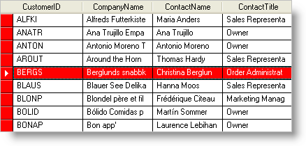

////

|metadata|
{
    "name": "wingrid-create-apply-appearances",
    "controlName": ["WinGrid"],
    "tags": ["Grids","How Do I","Styling"],
    "guid": "{54EDC9BE-84B2-4273-9DF0-3CEE1E105772}",  
    "buildFlags": [],
    "createdOn": "2005-11-07T00:00:00Z"
}
|metadata|
////

= Create/Apply Appearances

== To create and apply an Appearance object:

[start=1]
. To create an  pick:[win-forms="link:{ApiPlatform}win{ApiVersion}~infragistics.win.appearance.html[Appearance]"]  object, you use the  pick:[win-forms="link:{ApiPlatform}win{ApiVersion}~infragistics.win.appearancescollection.html[Appearances]"]  collection of the WinGrid™. Objects in the grid that support Appearances already have an Appearance object, so you do not need to create any Appearance objects if you don't want to. However, it is useful to create an Appearance object when you want to apply the same appearance to several different objects.

Start by adding an Appearance object to the Appearances collection and assigning it a key.

*In Visual Basic:*

----
Me.UltraGrid1.DisplayLayout.Appearances.Add("Highlighted")
----

*In C#:*

----
this.ultraGrid1.DisplayLayout.Appearances.Add("Highlighted");
----

[start=2]
. Once you have created an Appearance object, you can access its properties, such as BackColor and ForeColor.

*In Visual Basic:*

----
Me.UltraGrid1.DisplayLayout.Appearances("Highlighted").BackColor = Color.Red
Me.UltraGrid1.DisplayLayout.Appearances("Highlighted").ForeColor = Color.White
----

*In C#:*

----
this.ultraGrid1.DisplayLayout.Appearances["Highlighted"].BackColor = Color.Red;
this.ultraGrid1.DisplayLayout.Appearances["Highlighted"].BackColor = Color.White;
----

[start=3]
. You can then apply this Appearance to almost any object in the grid. For example, if you always want the ActiveRow to appear with white text on a red background, you can apply the Appearance you just created to the  pick:[win-forms="link:{ApiPlatform}win.ultrawingrid{ApiVersion}~infragistics.win.ultrawingrid.ultragridoverride~activerowappearance.html[ActiveRowAppearance]"]  of the grid.

*In Visual Basic:*

----
Me.UltraGrid1.DisplayLayout.Override.ActiveRowAppearance = _
  Me.UltraGrid1.DisplayLayout.Appearances("Highlighted")
----

*In C#:*

----
this.ultraGrid1.DisplayLayout.Override.ActiveRowAppearance = 
  this.ultraGrid1.DisplayLayout.Appearances["Highlighted"];
----

[start=4]
. You can apply the same settings to the  pick:[win-forms="link:{ApiPlatform}win.ultrawingrid{ApiVersion}~infragistics.win.ultrawingrid.ultragridoverride~rowselectors.html[RowSelectors]"]  by setting the  pick:[win-forms="link:{ApiPlatform}win.ultrawingrid{ApiVersion}~infragistics.win.ultrawingrid.ultragridrow~rowselectorappearance.html[RowSelectorAppearance]"]  to the same Appearance object.

*In Visual Basic:*

----
Me.UltraGrid1.DisplayLayout.Override.RowSelectorAppearance = _
  Me.UltraGrid1.DisplayLayout.Appearances("Highlighted")
----

*In C#:*

----
this.ultraGrid1.DisplayLayout.Override.RowSelectorAppearance = 
  this.ultraGrid1.DisplayLayout.Appearances["Highlighted"];
----

[start=5]
. You could have achieved the same effect by altering the RowSelectorAppearance and ActiveRowAppearance directly.

*In Visual Basic:*

----
Me.UltraGrid1.DisplayLayout.Override.ActiveRowAppearance.BackColor = Color.Red
Me.UltraGrid1.DisplayLayout.Override.ActiveRowAppearance.ForeColor = Color.White
Me.UltraGrid1.DisplayLayout.Override.RowSelectorAppearance.BackColor = Color.Red
Me.UltraGrid1.DisplayLayout.Override.RowSelectorAppearance.ForeColor = Color.White
----

*In C#:*

----
this.ultraGrid1.DisplayLayout.Override.ActiveRowAppearance.BackColor = Color.Red;
this.ultraGrid1.DisplayLayout.Override.ActiveRowAppearance.ForeColor = Color.White;
this.ultraGrid1.DisplayLayout.Override.RowSelectorAppearance.BackColor = Color.Red;
this.ultraGrid1.DisplayLayout.Override.RowSelectorAppearance.ForeColor = Color.White;
----

