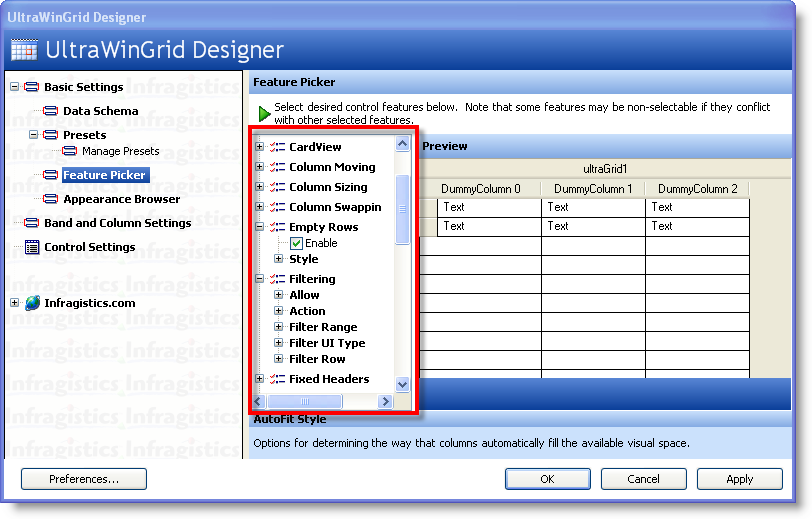
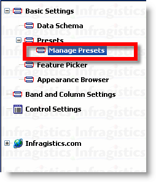
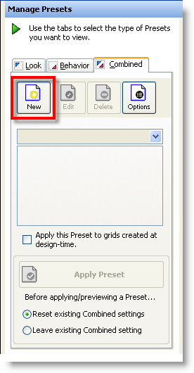
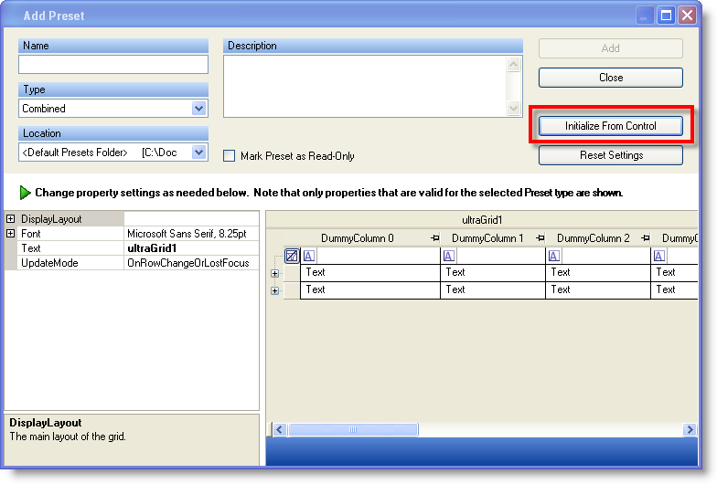
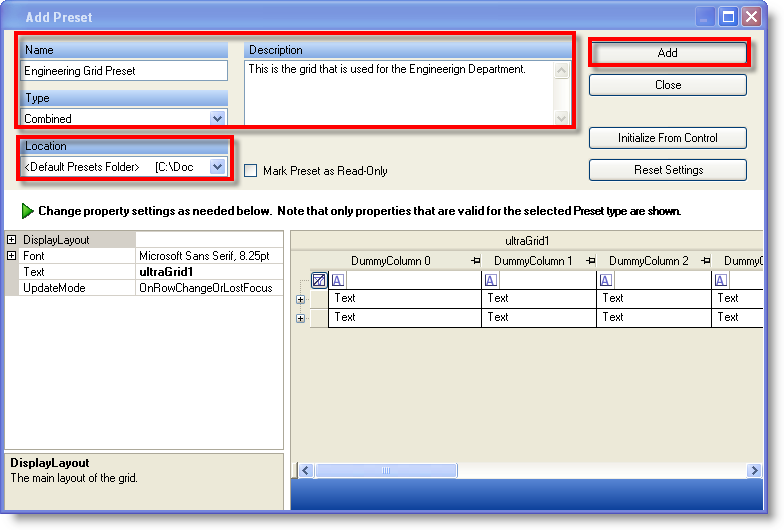
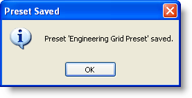
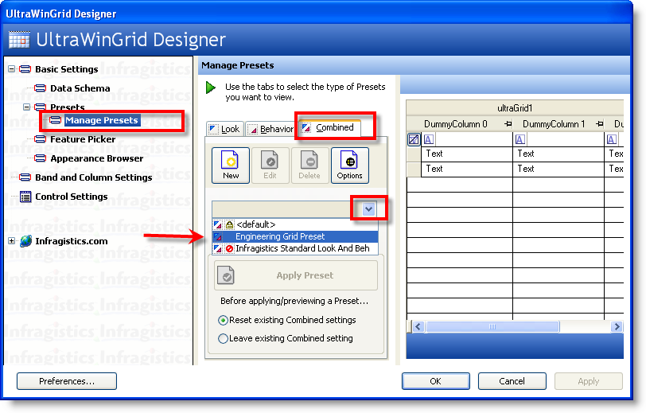
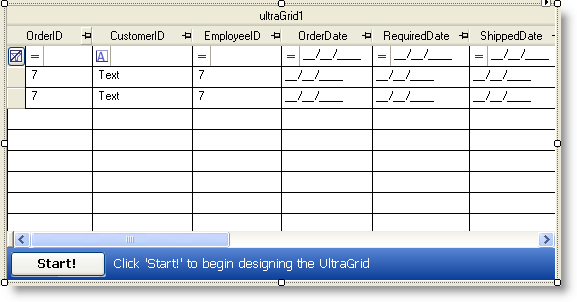

////

|metadata|
{
    "name": "wingrid-creating,-saving,-and-loading-a-layout",
    "controlName": ["WinGrid"],
    "tags": ["Grids","How Do I","Layouts"],
    "guid": "{0B54EEF3-B940-44A2-A9B3-601A8304899C}",  
    "buildFlags": [],
    "createdOn": "2009-08-12T10:23:54Z"
}
|metadata|
////

= Creating, Saving, and Loading a Layout

== Before You Begin:

The WinGrid™ control provides a way to create, save and load layouts that comprise of behavior property settings or appearance and style based property settings. You can enable or disable various features through the WinGrid Designer.

== What you will accomplish:

You will learn how to create, save and load a WinGrid layout using the WinGrid Designer. This topic will show how you can configure behavior based settings and save them as a layout, and use the same layout in the future when the control is loaded.

== Follow These Steps:

== Creating and Saving a Layout

1. From your Microsoft® Visual Studio® Toolbox, locate, drag and drop the UltraGrid control onto your form.

2. Click the WinGrid Start button to launch the WinGrid Designer.

3. Locate the Feature Picker node in the navigation tree at the left hand side of the WinGrid designer and click it. This will load a list of features and functionality in the right hand side. You can enable or disable the various features here.

.Note
[NOTE]
====
The Feature Picker represents behavior based property settings. The Appearance Browser section of the WinGrid designer represents appearance and styling based property settings.
====

4. Now that you have configured the WinGrid control with various feature settings, you can save this configuration into a Preset. Locate and click the Manage Presets button in the navigation tree located in the left hand side of the WinGrid Designer.

5. Click the New button to launch the Add Preset dialog.

6. In the Add Preset dialog, click the Initialize From Control button – this will apply the property settings that you have just configured to this simulation WinGrid that will be used to create the preset.

7. Once you click the Initialize From Control button, you should see the simulation WinGrid take on the property settings that you have configured through the WinGrid Designer. At this point, you can enter the Name and optionally enter the Description. You must also select the Type of preset this will represent. You can select from the following three options:

* Look – only appearance and style based properties will be saved in the preset.
* Behavior – only behavior based properties will be saved in this preset (E.g., sorting, fixed columns, filtering).
* Both – look and behavior based properties will be saved in this preset.

8. Click the Add button to save the new preset. If the save operation was successful, you will see the Preset Saved message box.

== Loading a Layout

1. From your Microsoft® Visual Studio® Toolbox, locate, drag and drop the UltraGrid control onto your form.

2. Click the WinGrid Start button to launch the WinGrid Designer.

3. In the left hand navigation tree, locate and click the Manage Presets node.

4. In the Manage Presets section located towards the right hand side of the WinGrid Designer, locate and click the Combined tab.

5. Click the drop down arrow and select the preset that you created in the previous tutorial (Engineering Grid Preset).

6. Click the Apply Preset button in order to apply these settings to the WinGrid instance on your form.

7. Click the Apply and OK buttons to close the WinGrid Designer.

8. Your WinGrid should now have all of the property settings defined in the Layout that you loaded. You can now continue to customize WinGrid by binding it to your data source.

The following image shows WinGrid that has been configured by loading the Engineering WinGrid Layout:

