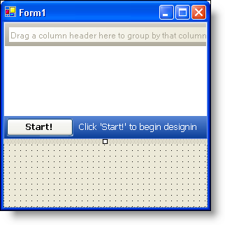
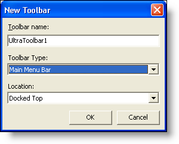
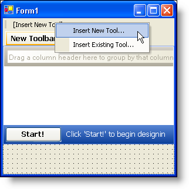
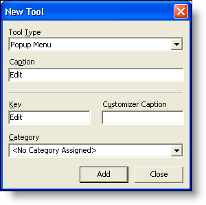
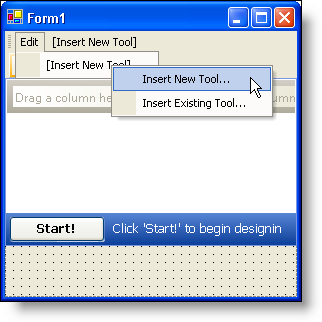
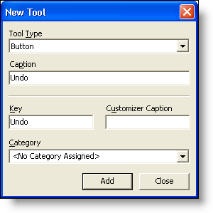
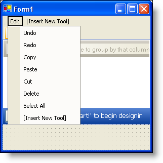
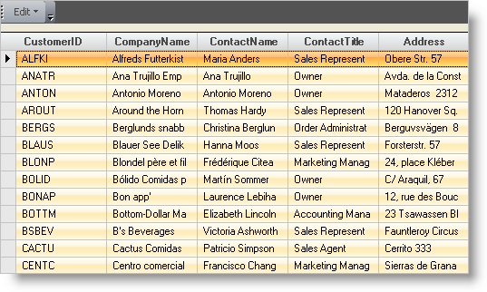

////
|metadata|
{
    "name": "wingrid-creating-edit-menu-with-clipboard-operations-for-wingrid",
    "controlName": ["WinGrid"],
    "tags": ["Application Scenarios","Grids","How Do I"],
    "guid": "{2955E97C-6A7C-4297-B4C2-160FD7830033}",
    "buildFlags": [],
    "createdOn": "0001-01-01T00:00:00Z"
}
|metadata|
////

= Creating Edit Menu with Clipboard Operations for WinGrid

== Before You Begin:

Performing clipboard operations in the WinGrid™ control is a very quick and easy task. This concept can be applied to any WinGrid with little to no tweaking. Clipboard operations come in the form of actions in WinGrid. This walkthrough will use the PerformAction method for the clipboard operations.

This method allows you to do several tasks with only one line of code. In this walkthrough, you will create an Edit menu with the WinToolbarsManager component. You will also create a grid with the WinGrid control. This grid will be bound to a data source created by the WinDataSource component. The Edit menu will contain several clipboard operations such as Copy, Paste, and Cut. You will use a switch statement to execute the specific action based on the tool's key.

== Follow these Steps:

. *Create a new Windows Forms project with the necessary controls.*

.. Create a new project.
.. Drag the UltraToolbarsManager component from the toolbox onto the form. An UltraToolbarsManager Initialization dialog box will open. Click Yes.
.. Drag the UltraDataSource component onto the form.
.. Drag the UltraGrid control onto the form. The UltraWinGrid Quick Start dialog box opens. Click Finish.
.. In the Properties window, set the WinGrid's DataSource property to ultraDataSource1.
.. Expand DisplayLayout and then Override. Set the AllowMultiCellOperations property to All.
.. Resize the grid so it is easier to see (e.g. set the Dock property to Fill).
+
Your form should look something like this:
+

. *Create the Edit menu on the toolbar.*

.. Select the ultraToolbarsManager1 component in the component tray. The New Toolbar… button will appear at the top of the form.
.. Click the New Toolbar... button. The New Toolbar dialog box opens. In the Toolbar Type drop-down list, select Main Menu Bar.
+

.. Click OK.
.. At the top of the form, Click [Insert New Tool].
+

.. The New Tool dialog box opens.
+

.. On the Tool Type drop-down list, select Pop-up Menu. In the Caption field, type Edit (The text in the Key field is automatically populated with the text in the Caption field).
.. Click Add then Close.
.. Click the newly added Edit tool. Click [Insert New Tool] and then Insert New Tool...
+

.. The New Tool dialog box opens. Change the Tool Type drop-down list to Button and in the caption field, type Undo (The text in the Key field is automatically populated with the text in the Caption field).
+

.. Click Add. The tool is added to the toolbar. You can now add more tools to the toolbar.
.. Repeat steps 'i' and 'j', to create Redo, Copy, Paste, Cut, Delete, and Select All tools, changing the caption to correspond with the tool's name. When you are finished adding tools, click Close. Your Edit menu should now look like this:
+

. *Create the code-behind.*

.. Make sure that the ultraToolbarsManager component in the component tray is selected.
.. Click the Event button in the Properties window.
.. Double-click the ToolClick event. The ToolClick event is created.
.. In this event, type the following code:
+
*In Visual Basic:*
[source, vb]
Imports Infragistics.Win.UltraWinGrid
...
Private Sub UltraToolbarsManager1_ToolClick(ByVal sender As System.Object, _
  ByVal e As Infragistics.Win.UltraWinToolbars.ToolClickEventArgs) _
  Handles UltraToolbarsManager1.ToolClick   
	Select Case e.Tool.Key
      Case "Undo"
         Me.ultraGrid1.PerformAction(UltraGridAction.Undo)
      Case "Redo"
         Me.ultraGrid1.PerformAction(UltraGridAction.Redo)
      Case "Copy"
         Me.ultraGrid1.PerformAction(UltraGridAction.Copy)
      Case "Paste"
         Me.ultraGrid1.PerformAction(UltraGridAction.Paste)
      Case "Cut"
         Me.ultraGrid1.PerformAction(UltraGridAction.Cut)
      Case "Delete"
         Me.ultraGrid1.PerformAction(UltraGridAction.DeleteCells)
      Case "Select All"
         Dim row As UltraGridRow
         For Each row In  Me.ultraGrid1.Rows.GetRowEnumerator(GridRowType.DataRow, Nothing, Nothing)
            row.Selected = True
         Next row
   End Select
End Sub
+

*In C#:*
[source, csharp]
using Infragistics.Win.UltraWinGrid;
...
private void ultraToolbarsManager1_ToolClick(object sender, 
  Infragistics.Win.UltraWinToolbars.ToolClickEventArgs e)
{
	switch (e.Tool.Key)
	{
	case "Undo":
		this.ultraGrid1.PerformAction(UltraGridAction.Undo);
		break;
	case "Redo":
		this.ultraGrid1.PerformAction(UltraGridAction.Redo);
		break;
	case "Copy":
		this.ultraGrid1.PerformAction(UltraGridAction.Copy);
		break;
	case "Paste":
		this.ultraGrid1.PerformAction(UltraGridAction.Paste);
		break;
	case "Cut":
		this.ultraGrid1.PerformAction(UltraGridAction.Cut);
		break;
	case "Delete":
		this.ultraGrid1.PerformAction(UltraGridAction.DeleteCells);
		break;
	case "Select All":
		foreach (UltraGridRow row in this.ultraGrid1.Rows.GetRowEnumerator(GridRowType.DataRow, null, null))
		{
			row.Selected = true;
		}
		break;
	}
}

. *Run the application.*
+
Click in any cell and select a clipboard operation from the Edit menu. The action is performed only on the cell level. If you were to change the CellClickAction property to RowSelect, then the clipboard operations would be performed on the row level. The Delete menu item will delete an entire row when invoked. You can change the code in the switch statement to perform the DeleteCells action rather than the DeleteRows action. The Select All menu item uses a new method in the Infragistics Windows Forms 2006 Volume 1 release. For more information on the GetRowEnumerator method, see link:wingrid-looping-through-the-entire-grid.html[Loop Through the Entire Grid].
+
