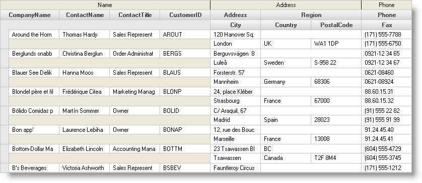

////

|metadata|
{
    "name": "wingrid-creating-multiple-row-layout-use-levels",
    "controlName": ["WinGrid"],
    "tags": ["Grids","How Do I"],
    "guid": "{28380F39-6175-49E4-9CCC-53027D3C7A42}",  
    "buildFlags": [],
    "createdOn": "2005-11-07T00:00:00Z"
}
|metadata|
////

= Creating Multiple-Row Layout Using Levels

A single row in the WinGrid™ can contain multiple Levels.

.Note
[NOTE]
====
This topic assumes you have a bound grid with at least one row of data.
====

== To create a multiple-row layout:

[start=1]
. To use multi-level rows, you must have your columns divided into  pick:[win-forms="link:{ApiPlatform}win.ultrawingrid{ApiVersion}~infragistics.win.ultrawingrid.ultragridgroup.html[Groups]"] . Start by creating some groups.

Suppose your database contained personal address information. Your fields might include First Name, Last Name, Street Address, City, State, Zip, Phone Number, Fax Number.

In this case, you might want three Groups like Name, Address, and Phone.

*In Visual Basic:*

----
Dim b As UltraGridBand = Me.UltraGrid1.DisplayLayout.Bands(0)
Dim theNameGroup As UltraGridGroup = b.Groups.Add("Name")
Dim theAddressGroup As UltraGridGroup = b.Groups.Add("Address")
Dim thePhoneGroup As UltraGridGroup = b.Groups.Add("Phone")
----

*In C#:*

----
UltraGridBand b = this.customersUltraGrid.DisplayLayout.Bands[0];
UltraGridGroup theNameGroup = b.Groups.Add("Name");
UltraGridGroup theAddressGroup = b.Groups.Add("Address");
UltraGridGroup thePhoneGroup = b.Groups.Add("Phone");
----

[start=2]
. You can then assign each  pick:[win-forms="link:{ApiPlatform}win.ultrawingrid{ApiVersion}~infragistics.win.ultrawingrid.ultragridcolumn.html[Column]"]  to a particular Group.

*In Visual Basic:*

----
b.Columns("CompanyName").Group = theNameGroup
b.Columns("ContactName").Group = theNameGroup
b.Columns("ContactTitle").Group = theNameGroup
b.Columns("CustomerID").Group = theNameGroup
b.Columns("Address").Group = theAddressGroup
b.Columns("Country").Group = theAddressGroup
b.Columns("City").Group = theAddressGroup
b.Columns("Region").Group = theAddressGroup
b.Columns("PostalCode").Group = theAddressGroup
b.Columns("Phone").Group = thePhoneGroup
b.Columns("Fax").Group = thePhoneGroup
----

*In C#:*

----
b.Columns["CompanyName"].Group = theNameGroup;
b.Columns["ContactName"].Group = theNameGroup;
b.Columns["ContactTitle"].Group = theNameGroup;
b.Columns["CustomerID"].Group = theNameGroup;
b.Columns["Address"].Group = theAddressGroup;
b.Columns["Country"].Group = theAddressGroup;
b.Columns["City"].Group = theAddressGroup;
b.Columns["Region"].Group = theAddressGroup;
b.Columns["PostalCode"].Group = theAddressGroup;
b.Columns["Phone"].Group = thePhoneGroup;
b.Columns["Fax"].Group = thePhoneGroup;
----

[start=3]
. To create a new level, set the  pick:[win-forms="link:{ApiPlatform}win.ultrawingrid{ApiVersion}~infragistics.win.ultrawingrid.ultragridband~levelcount.html[LevelCount]"]  property.

*In Visual Basic:*

----
b.LevelCount = 2
----

*In C#:*

----
b.LevelCount = 2;
----

[start=4]
. At this point, all the columns are on Level 0, and Level 1 is empty (Note that Levels are 0-based). Move some columns to the second (lower) level by setting the  pick:[win-forms="link:{ApiPlatform}win.ultrawingrid{ApiVersion}~infragistics.win.ultrawingrid.ultragridcolumn~level.html[Level]"]  property.

*In Visual Basic:*

----
b.Columns("City").Level = 1
b.Columns("Country").Level = 1
b.Columns("PostalCode").Level = 1
b.Columns("Fax").Level = 1
----

*In C#:*

----
b.Columns["City"].Level = 1;
b.Columns["Country"].Level = 1;
b.Columns["PostalCode"].Level = 1;
b.Columns["Fax"].Level = 1;
----

