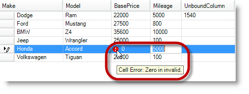
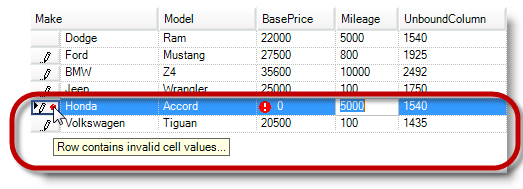

////
|metadata|
{
    "name": "wingrid-dataerrorinfo-support",
    "controlName": ["WinGrid"],
    "tags": ["Error Handling","Grids"],
    "guid": "7d55d255-5d79-4ed5-a617-346c974de165",
    "buildFlags": [],
    "createdOn": "2013-02-05T03:00:43.5042981Z"
}
|metadata|
////

= DataErrorInfo Support

== Topic Overview

=== Purpose

Not to be confused with the existing IDataErrorInfo interface, this topic introduces the  _WinGrid_™ control’s extended data validation feature and provides configuration examples to further your understanding.

=== Required background

The following topic is a prerequisite to understanding this topic:

[options="header", cols="a,a"]
|====
|Topic|Purpose

| link:wingrid-displaying-row-cell-errors-using-idataerrorinfo.html[Display Row/Cell Errors Using IDataErrorInfo]
|This topic will provide background information about `IDataErrorInfo` (.NET) interface used for row and cell errors to data bound controls.

|====

=== In this topic

This topic contains the following sections:

* <<_Ref347085242,Configuring DataErrorInfo in Cell and Row>>

** <<_Ref341518673,Introduction>>
** <<_Ref347151160,Enabling DataErrorInfo>>
** <<_Ref347085261,Applying data error to a cell>>
** <<_Ref347085268,Applying data error to a row>>

* <<_Ref341518687,Related Content>>

[[_Ref347085242]]
== Configuring DataErrorInfo in Cell and Row

[[_Ref341518673]]

=== Introduction

The  _WinGrid_   control already supports displaying errors, images and tooltips in rows and cells where the grid’s data source returns information via the `IDataErrorInfo` interface. Since the data errors were set and retrieved from the data source, the data validation was unavailable in unbound columns cells.

The link:{ApiPlatform}win.ultrawingrid{ApiVersion}~infragistics.win.ultrawingrid.ultragridrow+ultragridrowdataerrorinfo_methods.html[UltraGridRow.UltraGridRowDataErrorInfo] property allows getting or setting error information in rows, and cells within a row. This information is completely independent of any error information returned by the data source’s implementation of IDataErrorInfo. Applying an error to the `UltraGridRow.DataErrorInfo` does not affect the underlying data source errors in any way.

You can display data errors in cells of unbound columns, and rows that have not used the `IDataErrorInfo` interface. It also allows you to override the retrieved error text from the data source directly in  _UltraGridRow_   object.

.Note:
[NOTE]
====
While it is possible to override the DataSource’s error text using the `DataErrorInfo` applied to  _UltraGridRow_  , you cannot replace the errors presented on the DataSource with an empty string in an effort to hide or remove the text. Attempting to do so will display the error text from DataSource.
====

[[_Ref347151160]]

=== Enabling DataErrorInfo

To support the feature, you must first enable the link:{ApiPlatform}win.ultrawingrid{ApiVersion}~infragistics.win.ultrawingrid.supportdataerrorinfo.html[SupportDataErrorInfo] before applying or retrieving any errors on the grid.

Possible `SupportDataErrorInfo` enumeration options are:

*  _CellsOnly_  
*  _Default_   (No support)
*  _None_  
*  _RowsAndCells_  
*  _RowsOnly_  

*In C#:*

[source,csharp]
----
ultraGrid1.DisplayLayout.Override.SupportDataErrorInfo = SupportDataErrorInfo.RowsAndCells;
----

*In Visual Basic:*

[source,vb]
----
ultraGrid1.DisplayLayout.Override.SupportDataErrorInfo = SupportDataErrorInfo.RowsAndCells
----

[[_Ref341518679]]

=== Applying data error to a cell

Use the link:{ApiPlatform}win.ultrawingrid{ApiVersion}~infragistics.win.ultrawingrid.ultragridrow+ultragridrowdataerrorinfo~setcolumnerror.html[SetColumnError] method to set cells with data error information in the  _InitializeRow_   event.

*In C#:*

[source,csharp]
----
if ((double)e.Row.Cells["BasePrice"].Value == 0)
    e.Row.DataErrorInfo.SetColumnError("BasePrice", "Cell Error: Zero is invalid.");
----

*In Visual Basic:*

[source,vb]
----
If CDbl(e.Row.Cells("BasePrice").Value) = 0 Then
      e.Row.DataErrorInfo.SetColumnError("BasePrice", "Cell Error: Zero is invalid.")
End If
----

Use the link:{ApiPlatform}win.ultrawingrid{ApiVersion}~infragistics.win.ultrawingrid.ultragridrow+resolvedultragridrowdataerrorinfo~getcolumnerror.html[GetColumnError] method to retrieve a cell’s data error information.

*In C#:*

[source,csharp]
----
string columnError = e.Row.DataErrorInfo.GetColumnError("BasePrice");
----

*In Visual Basic:*

[source,vb]
----
Dim columnError As String = e.Row.DataErrorInfo.GetColumnError("BasePrice")
----

[[_Ref347085268]]

=== Applying data error to a row

The following code example uses the link:{ApiPlatform}win.ultrawingrid{ApiVersion}~infragistics.win.ultrawingrid.ultragridrow+ultragridrowdataerrorinfo~rowerror.html[RowError] property to apply data error information to a row in the  _InitializeRow_   event.

*In C#:*

[source,csharp]
----
if ((double)e.Row.Cells["BasePrice"].Value == 0)
    e.Row.DataErrorInfo.RowError = "Row contains invalid cell values...";
----

*In Visual Basic:*

[source,vb]
----
If CDbl(e.Row.Cells("BasePrice").Value) = 0 Then
      e.Row.DataErrorInfo.RowError = "Row contains invalid cell values..."
End If
----

As a side note, you can retrieve the resolved errors using link:{ApiPlatform}win.ultrawingrid{ApiVersion}~infragistics.win.ultrawingrid.ultragridrow~dataerrorinforesolved.html[DataErrorInfoResolved] property, which returns the resolved error information from the data source and grid rows.

[[_Ref341518687]]
== Related Content

=== Topics

The following topic provides additional information related to this topic.

[options="header", cols="a,a"]
|====
|Topic|Purpose

| link:wingrid-using-wingrid.html[Using WinGrid]
|In this list of sections you may find short, task-based topics that explain how to perform specific tasks related to the _WinGrid_ control.

|====