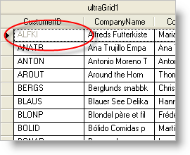

////

|metadata|
{
    "name": "wingrid-disabling-a-wingrid-cell",
    "controlName": ["WinGrid"],
    "tags": ["Grids","How Do I"],
    "guid": "{F7C38E0B-0CC2-464A-B765-4513CFF86E27}",  
    "buildFlags": [],
    "createdOn": "0001-01-01T00:00:00Z"
}
|metadata|
////

= Disabling a WinGrid Cell

You may need to disable a single link:{ApiPlatform}win.ultrawingrid{ApiVersion}~infragistics.win.ultrawingrid.ultragridcell.html[Cell] in the WinGrid™ control, or even a group of cells scattered throughout the grid. Each cell exposes an link:{ApiPlatform}win.ultrawingrid{ApiVersion}~infragistics.win.ultrawingrid.ultragridcell~activation.html[Activation] property, which you can set to the link:{ApiPlatform}win.ultrawingrid{ApiVersion}~infragistics.win.ultrawingrid.activation.html[Activation] enumeration. Through this property, you can implement an activation behavior for any cell in the WinGrid control. You can choose to have a cell activate only, allow editing, disable completely, or just disallow edits.

The following code disables the first cell in the first row of WinGrid by setting the Activation property to Disable. When disabled, a cell will display its text as grayed out, similar to the screenshot shown to the right. This topic assumes that you have a WinGrid control on your form with at least one band. For more information on data binding the WinGrid control, see Bind link:wingrid-binding-wingrid-to-a-flat-data-source-clr2.html[WinGrid to a Flat Data Source].

*In Visual Basic:*

----
Me.UltraGrid1.Rows(0).Cells(0).Activation = _
  Infragistics.Win.UltraWinGrid.Activation.Disabled
----

*In C#:*

----
this.ultraGrid1.Rows[0].Cells[0].Activation = 
  Infragistics.Win.UltraWinGrid.Activation.Disabled;
----

== Related Topics

link:wingrid-disabling-a-band-or-the-entire-wingrid.html[Disable a Band or the Entire WinGrid]

link:wingrid-disabling-a-wingrid-column.html[Disable a WinGrid Column]

link:wingrid-disabling-a-wingrid-row.html[Disable a WinGrid Row]