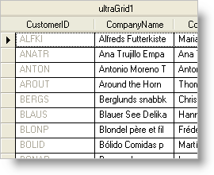

////

|metadata|
{
    "name": "wingrid-disabling-a-wingrid-column",
    "controlName": ["WinGrid"],
    "tags": ["Grids","How Do I"],
    "guid": "{3337FC79-9167-448E-8272-9983DEC8B94C}",  
    "buildFlags": [],
    "createdOn": "0001-01-01T00:00:00Z"
}
|metadata|
////

= Disabling a WinGrid Column

If your WinGrid™ contains columns of information that must not be modified, or don't apply in a specific situation, you can disable those columns by setting the link:{ApiPlatform}win.ultrawingrid{ApiVersion}~infragistics.win.ultrawingrid.ultragridcolumn~cellactivation.html[CellActivation] property off the link:{ApiPlatform}win.ultrawingrid{ApiVersion}~infragistics.win.ultrawingrid.ultragridcolumn.html[Column] object to Activation.Disabled. The link:{ApiPlatform}win.ultrawingrid{ApiVersion}~infragistics.win.ultrawingrid.activation.html[Activation] enumeration also contains other useful activation-specific settings which apply to each cell included in the given column.

The following code disables all the cells in the first column of the first band in a WinGrid control. When disabled, each cell in the column will display it's text as grayed out (unless an individual cell's activation is modified), similar to the screenshot above. This topic assumes that you have a WinGrid control on your form with at least one band. For more information on data binding the WinGrid control, see link:wingrid-binding-wingrid-to-a-flat-data-source-clr2.html[Bind WinGrid to a Flat Data Source].

*In Visual Basic:*

----
Me.UltraGrid1.DisplayLayout.Bands(0).Columns(0).CellActivation = _
  Infragistics.Win.UltraWinGrid.Activation.Disabled
----

*In C#:*

----
this.ultraGrid1.DisplayLayout.Bands[0].Columns[0].CellActivation = 
  Infragistics.Win.UltraWinGrid.Activation.Disabled;
----

== Related Topics

link:wingrid-disabling-a-band-or-the-entire-wingrid.html[Disable a Band or the Entire WinGrid]

link:wingrid-disabling-a-wingrid-cell.html[Disable a WinGrid Cell]

link:wingrid-disabling-a-wingrid-row.html[Disable a WinGrid Row]