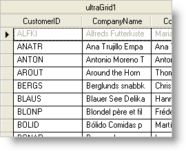

////

|metadata|
{
    "name": "wingrid-disabling-a-wingrid-row",
    "controlName": ["WinGrid"],
    "tags": ["Grids","How Do I"],
    "guid": "{BEF69F14-10C3-46A2-AD16-59BF6CD1F063}",  
    "buildFlags": [],
    "createdOn": "0001-01-01T00:00:00Z"
}
|metadata|
////

= Disabling a WinGrid Row

If a certain record in your database doesn't apply in a specific situation, or you need to keep your end users from modifying the data within that record, you can disable the link:{ApiPlatform}win.ultrawingrid{ApiVersion}~infragistics.win.ultrawingrid.ultragridrow.html[Row] that contains that record by setting its link:{ApiPlatform}win.ultrawingrid{ApiVersion}~infragistics.win.ultrawingrid.ultragridrow~activation.html[Activation] property to Activation.Disabled. The link:{ApiPlatform}win.ultrawingrid{ApiVersion}~infragistics.win.ultrawingrid.activation.html[Activation] enumeration also contains other useful activation-specific settings which apply to each cell included in the given row.

The following code disables all the cells in the first row of the WinGrid™ control. When disabled, each cell in the row will display it's text as grayed out (unless an individual cell's activation is modified), similar to the screenshot above. This topic assumes that you have a WinGrid control on your form with at least one band. For more information on data binding the WinGrid control, see link:wingrid-binding-wingrid-to-a-flat-data-source-clr2.html[Bind WinGrid to a Flat Data Source].

*In Visual Basic:*

----
Me.UltraGrid1.DisplayLayout.Rows(0).Activation = _
  Infragistics.Win.UltraWinGrid.Activation.Disabled
----

*In C#:*

----
this.ultraGrid1.DisplayLayout.Rows[0].Activation = 
  Infragistics.Win.UltraWinGrid.Activation.Disabled;
----

== Related Topics

link:wingrid-disabling-a-band-or-the-entire-wingrid.html[Disable a Band or the Entire WinGrid]

link:wingrid-disabling-a-wingrid-cell.html[Disable a WinGrid Cell]

link:wingrid-disabling-a-wingrid-column.html[Disable a WinGrid Column]