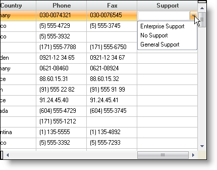

////

|metadata|
{
    "name": "wingrid-display-store-values-using-valuelists",
    "controlName": ["WinGrid"],
    "tags": ["Data Presentation","Grids","How Do I"],
    "guid": "{DE6F96EA-B259-4467-9E2A-CBDB9DE58353}",  
    "buildFlags": [],
    "createdOn": "2005-11-07T00:00:00Z"
}
|metadata|
////

= Display/Store Values Using ValueLists

Using  pick:[win-forms="link:{ApiPlatform}win{ApiVersion}~infragistics.win.valuelist.html[ValueLists]"] , you can display one value and store another. This example assumes your WinGrid™ is already bound to some type of data source.

== To display and store a ValueList:

[start=1]
. Before you start writing any code, you should place using/imports directives in your code-behind so you don't need to always type out a member's fully qualified name.

*In Visual Basic:*

----
Imports Infragistics.Win
----

*In C#:*

----
using Infragistics.Win;
----

[start=2]
. Add a ValueList to the UltraGrid ValueLists collection.

*In Visual Basic:*

----
Me.UltraGrid1.DisplayLayout.ValueLists.Add("List1")
----

*In C#:*

----
this.ultraGrid1.DisplayLayout.ValueLists.Add("List1");
----

[start=3]
. In order to show a particular value and save another value, you must work with the  pick:[win-forms="link:{ApiPlatform}win{ApiVersion}~infragistics.win.valuelistitem~datavalue.html[DataValue]"]  property as well as the  pick:[win-forms="link:{ApiPlatform}win{ApiVersion}~infragistics.win.valuelistitem~displaytext.html[DisplayText]"]  property when you add  pick:[win-forms="link:{ApiPlatform}win{ApiVersion}~infragistics.win.valuelistitem.html[ValueListItems]"]  to the ValueList. You can pass both of these values to the  pick:[win-forms="link:{ApiPlatform}win{ApiVersion}~infragistics.win.valuelistitemscollection~add.html[Add]"]  method of the  pick:[win-forms="link:{ApiPlatform}win{ApiVersion}~infragistics.win.valuelistitemscollection.html[ValueListItems]"]  collection when you are populating the value list.

*In Visual Basic:*

----
Me.UltraGrid1.DisplayLayout.ValueLists("List1").ValueListItems.Add(1, "Enterprise Support")
Me.UltraGrid1.DisplayLayout.ValueLists("List1").ValueListItems.Add(2, "No Support")
Me.UltraGrid1.DisplayLayout.ValueLists("List1").ValueListItems.Add(3, "General Support")
----

*In C#:*

----
this.ultraGrid1.DisplayLayout.ValueLists["List1"].ValueListItems.Add(1, "Enterprise Support");
this.ultraGrid1.DisplayLayout.ValueLists["List1"].ValueListItems.Add(2, "No Support");
this.ultraGrid1.DisplayLayout.ValueLists["List1"].ValueListItems.Add(3, "General Support");
----

[start=4]
. Make sure to set the display style of the ValueList so that it shows the DisplayText, and saves the DataValue.

*In Visual Basic:*

----
Me.UltraGrid1.DisplayLayout.ValueLists("List1").DisplayStyle = _
  ValueListDisplayStyle.DisplayText
----

*In C#:*

----
this.ultraGrid1.DisplayLayout.ValueLists["List1"].DisplayStyle = 
  ValueListDisplayStyle.DisplayText;
----

[start=5]
. Now that the ValueList is configured, associate the ValueList with a column

*In Visual Basic:*

----
Me.UltraGrid1.DisplayLayout.Bands(0).Columns.Add("Support")
Me.UltraGrid1.DisplayLayout.Bands(0).Columns("Support").ValueList = _
  Me.UltraGrid1.DisplayLayout.ValueLists("List1")
----

*In C#:*

----
this.ultraGrid1.DisplayLayout.Bands[0].Columns.Add("Support");
this.ultraGrid1.DisplayLayout.Bands[0].Columns["Support"].ValueList = 
  this.ultraGrid1.DisplayLayout.ValueLists["List1"];
----

