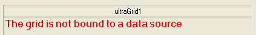
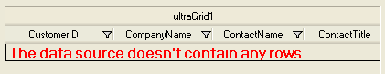
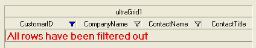

////

|metadata|
{
    "name": "wingrid-displaying-empty-message-in-wingrid",
    "controlName": ["WinGrid"],
    "tags": ["Error Handling","Grids"],
    "guid": "a51cfca5-316b-4e86-8817-6df0cf1ba6a7",  
    "buildFlags": [],
    "createdOn": "2012-03-26T17:27:06.8320303Z"
}
|metadata|
////

= Displaying Empty Message in WinGrid

== Topic Overview

=== Purpose

In WinGrid™ you can display a customized message at run time indicating that the grid has no data source bound to it, is bound to a data source that contains no rows, or all rows are filtered out.

=== In this topic

This topic contains the following sections:

* <<_Ref319929269,Control Configuration Summary>>
* <<_Ref319929935,No Data Source Message>>
* <<_Ref319929940,No Rows Message>>
* <<_Ref319929944,No Visible Rows Message>>
* <<_Ref319929275,Related Content>>

[[_Ref319929269]]
== Control Configuration Summary

=== Control configuration summary chart

The following table lists the empty message configurable aspects of the WinGrid control.

[options="header", cols="a,a,a"]
|====
|Configurable aspects|Details|Properties

|No Data Source Message
|When no data source is defined on the WinGrid a message is displayed to notify the user
|
* link:{ApiPlatform}win.ultrawingrid{ApiVersion}~infragistics.win.ultrawingrid.ultragridlayout~nodatasourcemessageenabled.html[NoDataSourceMessageEnabled] 

* link:{ApiPlatform}win.ultrawingrid{ApiVersion}~infragistics.win.ultrawingrid.ultragridlayout~nodatasourcemessagetext.html[NoDataSourceMessageText] 

* link:{ApiPlatform}win.ultrawingrid{ApiVersion}~infragistics.win.ultrawingrid.ultragridlayout~nodatasourcemessageappearance.html[NoDataSourceMessageAppearance] 

|No Rows Message
|When a data source is defined, but contains no rows a message is displayed to notify the user 

.Note: 

[NOTE] 

==== 

If the no visible rows message is enabled and all the rows in the grid are deleted, the no rows message will be shown. 

====
|
* link:{ApiPlatform}win.ultrawingrid{ApiVersion}~infragistics.win.ultrawingrid.ultragridoverride~norowsindatasourcemessageenabled.html[NoRowsInDataSourceMessageEnabled] 

* link:{ApiPlatform}win.ultrawingrid{ApiVersion}~infragistics.win.ultrawingrid.ultragridoverride~norowsindatasourcemessagetext.html[NoRowsInDataSourceMessageText] 

* link:{ApiPlatform}win.ultrawingrid{ApiVersion}~infragistics.win.ultrawingrid.ultragridoverride~norowsindatasourcemessageappearance.html[NoRowsInDataSourceMessageAppearance] 

|No Visible Rows Message
|When a data source is defined and it contains rows, but all rows are filtered out, a message is displayed to notify the user
|
* link:{ApiPlatform}win.ultrawingrid{ApiVersion}~infragistics.win.ultrawingrid.ultragridoverride~novisiblerowsmessageenabled.html[NoVisibleRowsMessageEnabled] 

* link:{ApiPlatform}win.ultrawingrid{ApiVersion}~infragistics.win.ultrawingrid.ultragridoverride~novisiblerowsmessagetext.html[NoVisibleRowsMessageText] 

* link:{ApiPlatform}win.ultrawingrid{ApiVersion}~infragistics.win.ultrawingrid.ultragridoverride~novisiblerowsmessageappearance.html[NoVisibleRowsMessageAppearance] 

|====

The link:{ApiPlatform}win{ApiVersion}~infragistics.win.appearance_members.html[Appearance] properties link:{ApiPlatform}win.ultrawingrid{ApiVersion}~infragistics.win.ultrawingrid.ultragridlayout~nodatasourcemessageappearance.html[NoDataSourceMessageAppearance], link:{ApiPlatform}win.ultrawingrid{ApiVersion}~infragistics.win.ultrawingrid.ultragridoverride~norowsindatasourcemessageappearance.html[NoRowsInDataSourceMessageAppearance], and link:{ApiPlatform}win.ultrawingrid{ApiVersion}~infragistics.win.ultrawingrid.ultragridoverride~novisiblerowsmessageappearance.html[NoVisibleRowsMessageAppearance] allow further customizations that include; text alignment, background color, foreground color, fonts, images, and more.

[[_Ref319929745]]
[[_Ref319929935]]
== No Data Source Message

=== Overview

When no data source is defined on the WinGrid control, a custom message can be displayed to notify the user.

=== Example

The screenshot below demonstrates how the WinGrid looks as a result of the following settings:

[options="header", cols="a,a"]
|====
|Property|Value

| link:{ApiPlatform}win.ultrawingrid{ApiVersion}~infragistics.win.ultrawingrid.ultragridlayout~nodatasourcemessageenabled.html[NoDataSourceMessageEnabled]
|True

| link:{ApiPlatform}win.ultrawingrid{ApiVersion}~infragistics.win.ultrawingrid.ultragridlayout~nodatasourcemessagetext.html[NoDataSourceMessageText]
|The grid is not bound to a data source

|====

[[_Ref319929750]]
[[_Ref319929940]]
== No Rows Message

=== Overview

When a data source is defined, but contains no rows a customizable message can be displayed to notify the user.

=== Example

The screenshot below demonstrates how the WinGrid looks as a result of the following settings:

[options="header", cols="a,a"]
|====
|Property|Value

| link:{ApiPlatform}win.ultrawingrid{ApiVersion}~infragistics.win.ultrawingrid.ultragridoverride~norowsindatasourcemessageenabled.html[NoRowsInDataSourceMessageEnabled]
|True

| link:{ApiPlatform}win.ultrawingrid{ApiVersion}~infragistics.win.ultrawingrid.ultragridoverride~norowsindatasourcemessagetext.html[NoRowsInDataSourceMessageText]
|The data source doesn't contain any rows

|====

[[_Ref319929759]]
[[_Ref319929944]]
== No Visible Rows Message

=== Overview

When a data source is defined, contains rows, but all rows have been filtered out, a customizable message can be displayed to notify the user.

=== Example

The screenshot below demonstrates how the WinGrid looks as a result of the following settings:

[options="header", cols="a,a"]
|====
|Property|Value

| link:{ApiPlatform}win.ultrawingrid{ApiVersion}~infragistics.win.ultrawingrid.ultragridoverride~novisiblerowsmessageenabled.html[NoVisibleRowsMessageEnabled]
|True

| link:{ApiPlatform}win.ultrawingrid{ApiVersion}~infragistics.win.ultrawingrid.ultragridoverride~novisiblerowsmessagetext.html[NoVisibleRowsMessageText]
|All rows have been filtered out

|====

[[_Ref319929275]]

== Related Content

=== Topics

The following topics provide additional information related to this topic.

[options="header", cols="a,a"]
|====
|Topic|Purpose

| link:wingrid-binding-wingrid-to-a-flat-data-source-clr2.html[Bind WinGrid to a Flat Data Source]
|This topic shows you how to add the WinGrid control to a Visual Studio .NET project and bind it to a flat data source (contains no child rows).

| link:wingrid-binding-wingrid-to-a-hierarchical-data-source-clr2.html[Bind WinGrid to a Hierarchical Data Source]
|This topic shows you how to add the WinGrid control to a Visual Studio .NET project and bind it to a hierarchical data source (contains child rows) .

|====