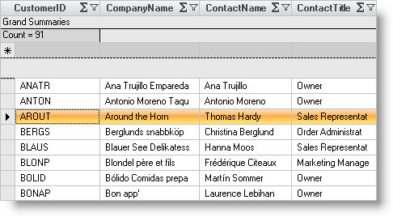

////

|metadata|
{
    "name": "wingrid-displaying-special-row-separators",
    "controlName": ["WinGrid"],
    "tags": ["Grids","How Do I","Styling"],
    "guid": "{40833AE4-5A8B-4003-B62F-C58425AE05B6}",  
    "buildFlags": [],
    "createdOn": "2005-11-07T00:00:00Z"
}
|metadata|
////

= Displaying Special Row Separators

The  pick:[win-forms="link:{ApiPlatform}win.ultrawingrid{ApiVersion}~infragistics.win.ultrawingrid.ultragridoverride~specialrowseparator.html[SpecialRowSeparator]"]  property lets you clearly separator the headers, filter row, fixed AddRow, fixed summary footer, fixed rows and non-fixed rows from the rows. When you use this feature, an extra UI element will be inserted below the specified special rows to create a visual gap.

== To display special row separators:

[start=1]
. Before you start writing any code, you should place using/imports directives in your code-behind so you don't need to always type out a member's fully qualified name.

*In Visual Basic:*

----
Imports Infragistics.Win
Imports Infragistics.Win.UltraWinGrid
----

*In C#:*

----
using Infragistics.Win;
using Infragistics.Win.UltraWinGrid;
----

[start=2]
. To enable this functionality set the SpecialRowSeparator property to the  pick:[win-forms="link:{ApiPlatform}win.ultrawingrid{ApiVersion}~infragistics.win.ultrawingrid.specialrowseparator.html[SpecialRowSeparator]"]  enumeration value(s) which affect the type(s) of special rows which need to be separated. The 'Default' value resolves to 'All', meaning that by default a separator will be displayed beneath each type of special row.

.Note
[NOTE]
====
SpecialRowSeparator is a flagged enumeration, so you can use bitwise operators to combine different enumeration values into one value.
====

*In Visual Basic:*

----
Me.UltraGrid1.DisplayLayout.Override.SpecialRowSeparator = SpecialRowSeparator.FixedRows
----

*In C#:*

----
this.ultraGrid1.DisplayLayout.Override.SpecialRowSeparator = SpecialRowSeparator.FixedRows;
----

[start=3]
. To control the appearance of the SpecialRowSeparator use the  pick:[win-forms="link:{ApiPlatform}win.ultrawingrid{ApiVersion}~infragistics.win.ultrawingrid.ultragridoverride~specialrowseparatorappearance.html[SpecialRowAppearance]"]  property on the Override.
[start=4]
. You can specify the height of the separators by setting the  pick:[win-forms="link:{ApiPlatform}win.ultrawingrid{ApiVersion}~infragistics.win.ultrawingrid.ultragridoverride~specialrowseparatorheight.html[SpecialRowSeparatorHeight]"]  property. The default height is 6 pixels.

*In Visual Basic:*

----
Me.UltraGrid1.DisplayLayout.Override.SpecialRowSeparatorHeight = 25
----

*In C#:*

----
this.ultraGrid1.DisplayLayout.Override.SpecialRowSeparatorHeight = 25;
----

[start=5]
. The final property you might want to change is the BorderStyle for the SpecialRowSeparator. You can do this by changing the  pick:[win-forms="link:{ApiPlatform}win.ultrawingrid{ApiVersion}~infragistics.win.ultrawingrid.ultragridoverride~borderstylespecialrowseparator.html[BorderStyleSpecialRowSeparator]"]  property. The default setting is 'RaisedSoft'.

*In Visual Basic:*

----
Me.UltraGrid1.DisplayLayout.Override.BorderStyleSpecialRowSeparator = _
  UIElementBorderStyle.Dashed
----

*In C#:*

----
this.ultraGrid1.DisplayLayout.Override.BorderStyleSpecialRowSeparator = 
  UIElementBorderStyle.Dashed;
----

[start=6]
. Using the above code you see a area out lined with a dashed line always separating your headers, filter row, fixed AddRow, fixed summary footer, fixed rows and non-fixed rows from your first row.

