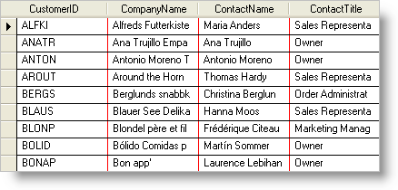

////

|metadata|
{
    "name": "wingrid-displaying-vertical-borders-in-columns",
    "controlName": ["WinGrid"],
    "tags": ["Grids","How Do I","Styling"],
    "guid": "{C954849F-0894-40F2-907B-A769AFDF04BC}",  
    "buildFlags": [],
    "createdOn": "2005-11-07T00:00:00Z"
}
|metadata|
////

= Displaying Vertical Borders in Columns

The following code demonstrates how to use the  pick:[win-forms="link:{ApiPlatform}win{ApiVersion}~infragistics.win.appearance~bordercolor.html[BorderColor]"]  property of the Cell's Appearance to display vertical lines for column borders.

*In Visual Basic:*

----
Private Sub Display_Vertical_Borders_in_Columns_Load(ByVal sender As System.Object, _
  ByVal e As System.EventArgs) Handles MyBase.Load
	Me.UltraGrid1.DisplayLayout.Override.CellAppearance.BorderColor = Color.Red
End Sub
----

*In C#:*

----
private void Display_Vertical_Borders_in_Columns_Load(object sender, EventArgs e)
{
	this.ultraGrid1.DisplayLayout.Override.CellAppearance.BorderColor = Color.Red;
}
----

