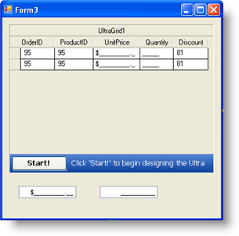
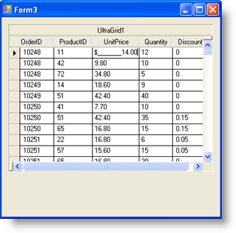

////

|metadata|
{
    "name": "wingrid-embeddable-column-editors",
    "controlName": ["WinGrid"],
    "tags": ["Application Scenarios","Extending","Grids"],
    "guid": "{3F520377-52F3-46C8-9002-B0D14C1E8B7B}",  
    "buildFlags": [],
    "createdOn": "0001-01-01T00:00:00Z"
}
|metadata|
////

= Embeddable Column Editors

== Before You Begin

Embeddable editors represent a major structural enhancement to WinGrid™ as well as other Infragistics Window Forms controls. Simply put, Embeddable editors embody all of the features and functionality that will allow you to provide a solid data entry point without having to write code. You can use these editors as stand-alone form controls or you can seamlessly integrate them into WinGrid.

Within the context of WinGrid, the embeddable editors are associated with the  pick:[win-forms="link:{ApiPlatform}win.ultrawingrid{ApiVersion}~infragistics.win.ultrawingrid.ultragridcolumn.html[UltraGridColumn]"]  object. Whenever you assign an embeddable editor to a WinGrid Column, an instance of that editor is used whenever data is being edited.

In WinGrid, embeddable editors are used automatically depending on the data type associated with the UltraGridColumn object. However, different types of editors can also be assigned using stand-alone elements. For example, suppose a column in WinGrid displays numeric data. By default, the control uses the Numeric embeddable editor to display and edit the data in that column. However, if the programmer wishes to display a different type of editor, say a Progress Bar, they can do so by adding the Progress Bar element to the form as a stand-alone element and then associating it with the UltraGridColumn object.

This is accomplished using a property of the UltraGridColumn object called  pick:[win-forms="link:{ApiPlatform}win.ultrawingrid{ApiVersion}~infragistics.win.ultrawingrid.ultragridcolumn~editorcomponent.html[EditorComponent]"] . This property can attach the UltraGridColumn to any element that implements the  pick:[win-forms="link:{ApiPlatform}win{ApiVersion}~infragistics.win.iprovidesembeddableeditor.html[IProvidesEmbeddableEditor]"]  interface, as all WinEditors™ do.

== What You Will Accomplish

The following steps show you how to assign an Editor to a WinGrid Column. The following steps assume you have a WinGrid that is bound to the Order_Details DataTable from the Northwind Database.

== Follow these Steps

[start=1]
. Locate the UltraCurrencyEditor and drag and drop it onto the Windows Form.
[start=2]
. Set its Visible property to False
[start=3]
. Locate the UltraNumericEditor and drag and drop it onto the Windows Form
[start=4]
. Set its Visible property to False
[start=5]
. Locate the UltraNumericEditor’s NumericType property and set it to Integer
[start=6]
. Set it’s MinValue property to 1
[start=7]
. Set its Value to 1
[start=8]
. At this point, your Form should look like this:

[start=9]
. Continue by clicking the Start button on the WinGrid to launch the UltraWinGrid Designer.
[start=10]
. Under Band and Column Settings, expand the Band[0] – 'Order Details' node and click the Columns node.
[start=11]
. In the Columns List, click the UnitPrice Column to expose its properties. Click the EditorComponent property and select UltraCurrencyEditor1 from the drop down list.
[start=12]
. Repeat the same steps by clicking on the Quantity Column, and from the EditorComponent property’s drop down list, select UltraNumericEditor1.
[start=13]
. Click Apply and OK to save the settings and to close the UltraWinGrid Designer Form.
[start=14]
. Save and run the application. Your WinGrid should look similar to the screen shot below.

If you click the UnitPrice cells, you will notice that for the text editing, the Currency Editor is used. It is correctly masked to only allow Currency values to be entered. Clicking into the Quantity Column also reveals that the Numeric Editor is used. If you type in anything other than numbers in either editor, the text will not change. If you try to enter a value less than 1 in the Numeric Editor, it too will not allow you to enter it. Only integer values can be entered as well. This example shows that with just a few property settings, you can have a full featured data entry point within the WinGrid.

