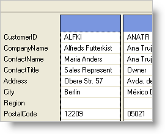

////

|metadata|
{
    "name": "wingrid-enabling-card-view",
    "controlName": ["WinGrid"],
    "tags": ["Grids","How Do I"],
    "guid": "{8C310FD9-48A5-4D9D-B5E9-C29F7F8BE884}",  
    "buildFlags": [],
    "createdOn": "2008-10-04T16:04:43Z"
}
|metadata|
////

= Enabling Card View

To enable Card View, you simply need to set the  pick:[win-forms="link:{ApiPlatform}win.ultrawingrid{ApiVersion}~infragistics.win.ultrawingrid.ultragridband~cardview.html[CardView]"]  property to True. The band that you wish to set to Card View is the Band where you must set the CardView property. The following code sets Band 0 to Card View. Again, note that whichever Band you set to Card View will be the last visible Band in the WinGrid™ control's hierarchy. If you have lower level Bands, they will not be visible.

*In Visual Basic:*

----
Me.ultraGrid1.DisplayLayout.Bands(0).CardView = True
----

*In C#:*

----
this.ultraGrid1.DisplayLayout.Bands[0].CardView = true;
----