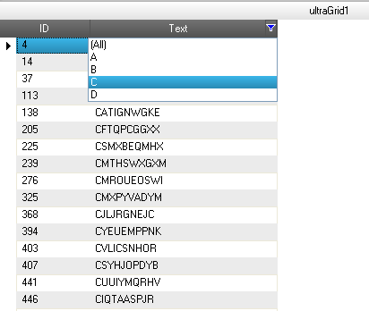

////

|metadata|
{
    "name": "wingrid-enabling-external-filtering",
    "controlName": ["WinGrid"],
    "tags": ["Filtering","How Do I"],
    "guid": "7938de02-e99f-4ddd-977b-06fdb65598f4",  
    "buildFlags": [],
    "createdOn": "2012-03-12T15:29:42.1206151Z"
}
|metadata|
////

= Enabling External Filtering

== Topic Overview

=== Purpose

This topic demonstrates, with code examples, how to enable and implement external filtering functionality in the WinGrid™ control.

=== In this topic

This topic contains the following sections:

* <<_Ref320622912,External Filtering in the WinGrid – Conceptual Overview>>
** <<_Ref320622922,Introduction>>
** <<_Ref320622934,Enabling external filtering>>

* <<_Ref320622946,External Filtering in the WinGrid– Code Example>>
** <<_Ref320622640,Introduction>>
** <<_Ref320622582,Preview>>
** <<_Ref320622990,Prerequisites>>
** <<_Ref320623001,Overview>>
** <<_Ref320623006,Steps>>

* <<_Ref320623014,Related Content>>

[[_External_Filtering_in]]
[[_Ref320622912]]
== External Filtering in the WinGrid – Conceptual Overview

[[_Introduction_1]]

=== Introduction

With external filtering enabled, the UltraGrid™ control’s built-in filtering user interface (UI) is retained, but the internal filtering logic is bypassed and there is no need for all rows to be loaded at the same time. This enables WinGrid to filter data with the supplied custom filtering code and also utilize the `LoadOnDemand` functionality*.*

[[_Enabling_external_filtering]]

=== Enabling external filtering

To enable external filtering, you need to disable the default filtering action and some events must be added to handle your custom filtering logic and populate the filter value list with your custom filtering values. (The filter value list will not be populated by the grid. However, the default options  _Custom_,  _Blanks_,  _NonBlanks_  _,_  and  _All_  will be available in the filter drop-down.)

The following table lists the steps to enabling external filtering.

=== 1. Disable the default filtering action.

Set the link:{ApiPlatform}win.ultrawingrid{ApiVersion}~infragistics.win.ultrawingrid.ultragridoverride~rowfilteraction.html[RowFilterAction] property to  _None_ .

*In Visual Basic:*

[source,vb]
----
Me.UltraGrid1.DisplayLayout.Override.RowFilterAction = RowFilterAction.None
----

*In C#:*

[source,csharp]
----
this.ultraGrid1.DisplayLayout.Override.RowFilterAction = RowFilterAction.None;
----

=== 2. Populate the drop-down with the custom filtering values.

Handle the link:{ApiPlatform}win.ultrawingrid{ApiVersion}~infragistics.win.ultrawingrid.ultragridbase~beforerowfilterdropdownpopulate_ev.html[BeforeRowFilterDropDownPopulate] event.

*In Visual Basic:*

[source,vb]
----
Private Sub UltraGrid1_BeforeRowFilterDropDownPopulate(ByVal sender As System.Object, _
 ByVal e As Infragistics.Win.UltraWinGrid.BeforeRowFilterDropDownPopulateEventArgs) Handles UltraGrid1.BeforeRowFilterDropDownPopulate
End Sub
----

*In C#:*

[source,csharp]
----
private void ultraGrid1_BeforeRowFilterDropDownPopulate(object sender, BeforeRowFilterDropDownPopulateEventArgs e)
{
}
----

=== 3. Add custom filtering logic.

Handle the link:{ApiPlatform}win.ultrawingrid{ApiVersion}~infragistics.win.ultrawingrid.ultragridbase~afterrowfilterchanged_ev.html[AfterRowFilterChanged] event.

*In Visual Basic:*

[source,vb]
----
Private Sub UltraGrid1_AfterRowFilterChanged(ByVal sender As System.Object, ByVal e As Infragistics.Win.UltraWinGrid.AfterRowFilterChangedEventArgs) Handles UltraGrid1.AfterRowFilterChanged
End Sub
----

*In C#:*

[source,csharp]
----
private void ultraGrid1_AfterRowFilterChanged(object sender, AfterRowFilterChangedEventArgs e)
{
}
----

[[_External_Filtering_in_1]]
[[_Ref320622946]]
== External Filtering in the WinGrid– Code Example

[[_Introduction]]

=== Introduction

The following example demonstrates how to implement custom filtering to display and filter values starting with  _A_,  _B_,  _C_,  _D_  from the Text column of the WinGrid. This is achieved by adding custom filtering logic to display the alphabets  _A_,  _B_,  _C_, and  _D_  in the filter drop-down of the  _Text_  column and filtering the grid by the selected value from the filter drop-down list.

In this example, the WinGrid control is bound to the WinDataSource™ component. For the purpose of demonstration, a dataset is used as the back-end data storage which supplies data for the WinDataSource™ component.

[[_Preview]]

=== Preview

The following screenshot is a preview of the final result: WinGrid showing records filtered out using the custom filtering logic with in-built filtering UI.

[[_Prerequisites]]

=== Prerequisites

To complete the procedure, you need the following:

* A form with an UltraGrid control and UltraDataSource component added to it

[[_Overview]]

=== Overview

Following is a conceptual overview of the process:

[start=1]
. Defining private members
[start=2]
. Configuring the back-end data storage
[start=3]
. Generating random data
[start=4]
. Defining the row/column schema for the data source component
[start=5]
. Defining the grid load style
[start=6]
. Disabling the default filtering action
[start=7]
. Supplying the data
[start=8]
. Populating the drop-down with the custom filtering values
[start=9]
. Adding your custom filtering logic

[[_Steps]]

=== Steps

The following steps demonstrate how to enable external filtering on WinGrid and apply the custom filtering logic stated in the <<_Ref320622640,Introduction>>.

=== 1. Define private members.

Define a dataset and data row.

*In Visual Basic:*

[source,vb]
----
Imports Infragistics.Win
Imports Infragistics.Win.UltraWinGrid
Private ds As DataSet
Private rows As DataRow()
----

*In C#:*

[source,csharp]
----
using Infragistics.Win;
using Infragistics.Win.UltraWinGrid;
private DataSet ds;
private DataRow[] rows;
----

=== 2. Configure the back-end data storage.

A dataset with two columns and one million rows is defined.

*In Visual Basic:*

[source,vb]
----
Dim dt As New DataTable()
Dim dc As New DataColumn("ID")
dc.DataType = System.Type.[GetType]("System.Int32")
dt.Columns.Add(dc)
dc = New DataColumn("Text")
dc.DataType = System.Type.[GetType]("System.String")
dt.Columns.Add(dc)
Dim dr As DataRow
For i As Integer = 0 To 999999
Dim record As New Record(Me.GetRandomString(10))
dr = dt.NewRow()
dr(0) = record.id
dr(1) = record.textField
dt.Rows.Add(dr)
Next
ds = New DataSet()
ds.Tables.Add(dt)
rows = dt.[Select]()
----

*In C#:*

[source,csharp]
----
DataTable dt = new DataTable();
DataColumn dc = new DataColumn("ID");
dc.DataType = System.Type.GetType("System.Int32");
dt.Columns.Add(dc);
dc = new DataColumn("Text");
dc.DataType = System.Type.GetType("System.String");
dt.Columns.Add(dc);
DataRow dr;
for (int i = 0; i < 1000000; i++)
{
Record record = new Record(this.GetRandomString(10));
dr = dt.NewRow();
dr[0] = record.id;
dr[1] = record.textField;
dt.Rows.Add(dr);
}
ds = new DataSet();
ds.Tables.Add(dt);
rows = dt.Select();
----

=== 3. Generate random data.

The following code generates random data, which is supplied to the UltraDataSource component within the  _CellDataRequested_  event. Random strings are supplied to the  _Text_  column.

*In Visual Basic:*

[source,vb]
----
Private Class Record
Friend Shared ID_COUNTER As Integer = 0
Friend id As Integer
Friend textField As String
Friend Sub New(ByVal textField As String)
Me.id = ID_COUNTER
ID_COUNTER += 1
Me.textField = textField
End Sub
End Class
Private random As New Random()
Private Function GetRandomString(ByVal len As Integer) As String
Dim sb As System.Text.StringBuilder = New System.Text.StringBuilder(len)
Dim i As Integer
For i = 0 To len - 1
Dim a As Char = "A"
Dim z As Char = "Z"
sb.Append(Chr(Asc(a) + Me.random.Next(Asc(z) - Asc(a))))
Next
Return sb.ToString()
End Function
----

*In C#:*

[source,csharp]
----
private class Record
{
internal static int ID_COUNTER = 0;
internal int id;
internal string textField;
internal Record(string textField)
{
this.id = ID_COUNTER;
ID_COUNTER++;
this.textField = textField;
}
}
private Random random = new Random();
private string GetRandomString(int len)
{
System.Text.StringBuilder sb = new System.Text.StringBuilder(len);
for (int i = 0; i < len; i++)
sb.Append((char)('A' + this.random.Next('Z' - 'A')));
return sb.ToString();
}
----

=== 4. Define the Row/Column Schema for the data source component.

Add this code within  _Form_  load event to define the columns and rows for the UltraDataSource™ component.

*In Visual Basic:*

[source,vb]
----
' Add two columns, one ID column of type int and second Text column of
' type string.
Me.UltraDataSource1.Band.Columns.Add("ID", GetType(Integer))
' Make id column read-only.
Me.UltraDataSource1.Band.Columns("ID").[ReadOnly] = DefaultableBoolean.[True]
Me.UltraDataSource1.Band.Columns.Add("Text", GetType(String))
' Set the row count. This is how many rows we will have.
Me.UltraDataSource1.Rows.SetCount(Me.ds.Tables(0).Rows.Count)
----

*In C#:*

[source,csharp]
----
// Add two columns, one ID column of type int and second Text column of type string.
this.ultraDataSource1.Band.Columns.Add("ID", typeof(int));
// Make id column read-only.
this.ultraDataSource1.Band.Columns["ID"].ReadOnly = DefaultableBoolean.True;
this.ultraDataSource1.Band.Columns.Add("Text", typeof(string));
// Set the row count. This is how many rows we will have.
this.ultraDataSource1.Rows.SetCount(this.ds.Tables[0].Rows.Count);
----

=== 5. Define the grid load style.

Set link:{ApiPlatform}win.ultrawingrid{ApiVersion}~infragistics.win.ultrawingrid.ultragridlayout~loadstyle.html[LoadStyle] to `LoadOnDemand` so that the grid can load data on demand. Add this code within the form’s Load event.

*In Visual Basic:*

[source,vb]
----
' Set the LoadStyle to LoadOnDemand so the UltraGrid 'doesn't pre-load all the rows. LoadOnDemand load style 'creates rows as they are needed (for example when they are 'scrolled into view). You must do this before setting the 'DataSource on the UltraGrid.
Me.UltraGrid1.DisplayLayout.LoadStyle = LoadStyle.LoadOnDemand
----

*In C#:*

[source,csharp]
----
// Set the LoadStyle to LoadOnDemand so the UltraGrid //doesn't pre-load all the rows. LoadOnDemand load style //creates rows as they are needed (for example when they //are scrolled into view). You must do this before setting //the DataSource on the UltraGrid.
this.ultraGrid1.DisplayLayout.LoadStyle = LoadStyle.LoadOnDemand;
----

=== 6. Disable the default filtering action.

In order to display the WinGrid control’s built-in filtering UI without any internal filtering logic, the link:{ApiPlatform}win.ultrawingrid{ApiVersion}~infragistics.win.ultrawingrid.ultragridoverride~rowfilteraction.html[RowFilterAction] property must be set to `None`. Since internal filtering logic is bypassed, the grid data can load data on demand.

Add this code within the form’s load event.

*In Visual Basic:*

[source,vb]
----
Me.UltraGrid1.DataSource = Me.UltraDataSource1
Me.UltraGrid1.DisplayLayout.Bands(0).Columns("Text").AllowRowFiltering = DefaultableBoolean.[True]
' Enable only the Filtering UI of UltraGrid without any filtering action
Me.UltraGrid1.DisplayLayout.Override.RowFilterAction = RowFilterAction.None
----

*In C#:*

[source,csharp]
----
this.ultraGrid1.DataSource = this.ultraDataSource1;
this.ultraGrid1.DisplayLayout.Bands[0].Columns["Text"].AllowRowFiltering = DefaultableBoolean.True;
// Enable only the Filtering UI of UltraGrid without any filtering action
this.ultraGrid1.DisplayLayout.Override.RowFilterAction = RowFilterAction.None;
----

=== 7. Supply the data.

The data required for the UltraDataSource component is supplied from within the link:{ApiPlatform}win.ultrawindatasource{ApiVersion}~infragistics.win.ultrawindatasource.ultradatasource~celldatarequested_ev.html[CellDataRequested] event. This event is fired when an UltraGrid bound to UltraDataSource component, requests value for a cell and the UltraDataSource component doesn't have the cell values. The following code resides within the  _CellDataRequested_  event of the UltraDataSource component.

*In Visual Basic:*

[source,vb]
----
Dim columnKey As String = e.Column.Key
If rows.Length > e.Row.Index Then
If "ID" = columnKey Then
e.Data = CInt(rows(e.Row.Index)(0))
ElseIf "Text" = columnKey Then
e.Data = DirectCast(rows(e.Row.Index)(1), String)
End If
End If
' By default UltraDataSource will cache the provided cell value and not ask for
' it next time it's needed. Set CacheData to false to prevent UltraDataSource
' from doing so.
e.CacheData = False
----

*In C#:*

[source,csharp]
----
string columnKey = e.Column.Key;
if (rows.Length > e.Row.Index)
{
if ("ID" == columnKey)
{
e.Data = (int)rows[e.Row.Index][0];
}
else if ("Text" == columnKey)
{
e.Data = (string)rows[e.Row.Index][1];
}
}
// By default UltraDataSource will cache the provided cell value and not ask for
// it next time it's needed. Set CacheData to false to prevent UltraDataSource
// from doing so.
e.CacheData = false;
----

=== 8. Populate the drop-down with the custom filtering values.

The link:{ApiPlatform}win.ultrawingrid{ApiVersion}~infragistics.win.ultrawingrid.ultragridbase~beforerowfilterdropdownpopulate_ev.html[BeforeRowFilterDropDownPopulate] event of the UltraGrid must be handled to manually populate the filter drop-down value list items. Here the filter drop down is populated with the alphabets ‘A’, ‘B’, ‘C’ and ‘D’ as the value list items.

*In Visual Basic:*

[source,vb]
----
' Add code to manually populate the filter drop down here...
If "Text" = e.Column.Key Then
' The following code demonstrates removing of default value list items from the filter drop down
For i As Integer = e.ValueList.ValueListItems.Count - 1 To 0 Step -1
' Remove 'Custom' option from the filter drop down.
If e.ValueList.ValueListItems(i).DisplayText.Equals("(Custom)") Then
e.ValueList.ValueListItems.RemoveAt(i)
' Remove 'Blanks' option from the filter drop down.
ElseIf e.ValueList.ValueListItems(i).DisplayText.Equals("(Blanks)") Then
e.ValueList.ValueListItems.RemoveAt(i)
' Remove 'NonBlanks' option from the filter drop down.
ElseIf e.ValueList.ValueListItems(i).DisplayText.Equals("(NonBlanks)") Then
e.ValueList.ValueListItems.RemoveAt(i)
End If
Next
' Populate the filter drop-down with four items that filter by 'the first letter of the cell value.
e.ValueList.ValueListItems.Add("A")
e.ValueList.ValueListItems.Add("B")
e.ValueList.ValueListItems.Add("C")
e.ValueList.ValueListItems.Add("D")
End If
----

*In C#:*

[source,csharp]
----
// Add code to manually populate the filter drop down here...
if ("Text" == e.Column.Key)
{
// The following code demonstrates removing of default value list items from the filter drop down
for (int i = e.ValueList.ValueListItems.Count - 1; i >= 0; i--)
{
// Remove 'Custom' option from the filter drop down.
if (e.ValueList.ValueListItems[i].DisplayText.Equals("(Custom)"))
e.ValueList.ValueListItems.RemoveAt(i);
// Remove 'Blanks' option from the filter drop down.
else if (e.ValueList.ValueListItems[i].DisplayText.Equals("(Blanks)"))
e.ValueList.ValueListItems.RemoveAt(i);
// Remove 'NonBlanks' option from the filter drop down.
else if (e.ValueList.ValueListItems[i].DisplayText.Equals("(NonBlanks)"))
e.ValueList.ValueListItems.RemoveAt(i);
}
// Populate the filter drop-down with four items that filter by // the first letter of the cell value.
e.ValueList.ValueListItems.Add("A");
e.ValueList.ValueListItems.Add("B");
e.ValueList.ValueListItems.Add("C");
e.ValueList.ValueListItems.Add("D");
----

=== 9. Add your custom filtering logic.

To add custom filtering logic, the link:{ApiPlatform}win.ultrawingrid{ApiVersion}~infragistics.win.ultrawingrid.ultragridbase~afterrowfilterchanged_ev.html[AfterRowFilterChanged] event of the UltraGrid must be handled. Here, the code is written to filter all the records starting with the alphabet that is selected from the  _Text_  column filter drop-down list.

*In Visual Basic:*

[source,vb]
----
If e.NewColumnFilter.FilterConditions.Count > 0 Then
' Set the cursor to wait since it might take a while for the filter operation to complete.
Cursor.Current = Cursors.WaitCursor
If (e.NewColumnFilter.FilterConditions(0).CompareValue).ToString() = "A" Then
rows = ds.Tables(0).[Select]("Text LIKE 'A%'")
ElseIf (e.NewColumnFilter.FilterConditions(0).CompareValue).ToString() = "B" Then
rows = ds.Tables(0).[Select]("Text LIKE 'B%'")
ElseIf (e.NewColumnFilter.FilterConditions(0).CompareValue).ToString() = "C" Then
rows = ds.Tables(0).[Select]("Text LIKE 'C%'")
ElseIf (e.NewColumnFilter.FilterConditions(0).CompareValue).ToString() = "D" Then
rows = ds.Tables(0).[Select]("Text LIKE 'D%'")
End If
Else
rows = ds.Tables(0).[Select]()
End If
Cursor.Current = Cursors.[Default]
' Clears all cached cell values
Me.UltraDataSource1.Rows.ResetCachedValues()
Me.UltraDataSource1.Rows.SetCount(rows.Length)
----

*In C#:*

[source,csharp]
----
if (e.NewColumnFilter.FilterConditions.Count > 0)
{
// Set the cursor to wait since it might take a while for the filter operation to complete.
Cursor.Current = Cursors.WaitCursor;
if ((e.NewColumnFilter.FilterConditions[0].CompareValue).ToString() == "A")
{
rows = ds.Tables[0].Select("Text LIKE 'A%'");
}
else if ((e.NewColumnFilter.FilterConditions[0].CompareValue).ToString() == "B")
{
rows = ds.Tables[0].Select("Text LIKE 'B%'");
}
else if ((e.NewColumnFilter.FilterConditions[0].CompareValue).ToString() == "C")
{
rows = ds.Tables[0].Select("Text LIKE 'C%'");
}
else if ((e.NewColumnFilter.FilterConditions[0].CompareValue).ToString() == "D")
{
rows = ds.Tables[0].Select("Text LIKE 'D%'");
}
}
else
{
rows = ds.Tables[0].Select();
}
Cursor.Current = Cursors.Default;
// Clears all cached cell values
this.ultraDataSource1.Rows.ResetCachedValues();
this.ultraDataSource1.Rows.SetCount(rows.Length);
----

=== 10. Verify the result.

To verify the result, click the filter icon on the Text column of the Grid. If external filtering is implemented correctly, the filter criteria should be visible and functional in the drop-down as shown in the <<_Ref320622582,Preview>>.

[[_Related_Content]]
[[_Ref320623014]]
== Related Content

=== Topics

The following topics provide additional information related to this topic.

[options="header", cols="a,a"]
|====
|Topic|Purpose

| link:wingrid-using-the-filter-row-feature.html[Use the Filter Row Feature]
|This topic demonstrates, with code examples, how to enable row filtering and using the Filter Row feature.

| link:windatasource-load-data-on-demand.html[Load Data On-Demand]
|This topic explains, with code examples, how to load data on demand.

|====