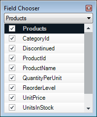

////
|metadata|
{
    "name": "wingrid-enabling-multiple-row-selection",
    "controlName": [],
    "tags": [],
    "guid": "5a58f37c-5511-4920-b13d-87fc8a99ff8e",
    "buildFlags": [],
    "createdOn": "2015-02-27T19:34:32.4420836Z"
}
|metadata|
////

= Enabling Multiple Row Selection

=== Purpose

This topic provides a conceptual overview of how to enable multiple row selection in the  _WinGrid_™ ColumnChooser. This feature can be useful in scenarios where the changing the visibility or position of large numbers of columns is an application requirement.

=== Required background

The following topics are prerequisites to understanding this topic:

[options="header", cols="a,a"]
|====
|Topic|Purpose

| link:wingrid-using-the-column-chooser-feature.html[Using the Column Chooser Feature]
|Contains general information related to using the _WinGrid_™ Column Chooser feature.

|====

=== In this topic

This topic contains the following sections:

* <<EnablingMultipleRowSelectionOverview,Enabling Multiple Row Selection Overview>>

** <<Overview,Overview>>
** <<Preview,Preview>>

* <<UltraGridColumnChooserClass,UltraGridColumnChooser Class>>

** <<UltraGridColumnChooserSummary,UltraGridColumnChooser Summary>>

* <<Configuringthecolumnchooserformultiplerowselection,Configuring the column chooser for multiple row selection>>

** <<Example,Example>>

* <<RelatedContent,Related Content>>

[[EnablingMultipleRowSelectionOverview]]
== Enabling Muliple Row Selection Overview

[[Overview]]

=== Overview

The  _WinGrid_™ ColumnChooser is used to provide a front end through which the user can change the visibility and/or position of the grid’s columns. The chooser can be presented to the user via several different approaches; for example, on a dialog which is displayed when a button in the grid is clicked, or as a standalone control residing on the same form.

The following screen shot shows the column chooser as it appears on the dialog that is displayed when a button in the grid is clicked:

The checkbox on each row depicts the visibility of the corresponding column header; unchecking a row hides the corresponding column. In previous versions, the selection of rows was limited to only one at a time. Because of this, the visibility of only one column at a time could be affected through user interaction. The column chooser also supports column positioning via drag and drop. This action was also restricted to one column at a time in previous versions. A new property has been added to the UltraGridColumnChooser control, MultiSelect Enabled, which switches on multiple row selection, subsequently allowing the visibility or position of any number of columns to be changed in one atomic operation via user interaction.

[[Preview]]

=== Preview

The following screenshot shows the same ColumnChooser as above with the link:{ApiPlatform}win.ultrawingrid{ApiVersion}~infragistics.win.ultrawingrid.ultragridcolumnchooser~multiselectenabled.html[MultiSelectEnabled] property of the UltraGridColumnChooser control set to true, after clicking the ‘Discontinued’, ‘ProductName’, and ‘ReorderLevel’ rows while pressing the control key, i.e. after a standard extended selection.

image::images/ColumnChooser_1.png[]

Clicking a checkbox on any of the selected rows will change the state for all the selected rows, with the new value being the inverse of the current state of the first row in the selection. For example, if the first row is currently selected, the check state of all rows in the selection is set to Unchecked, thus hiding the three associated columns. Pressing the spacebar has the same effect – the check state for all selected rows is affected, not just the currently active row.Additionally, initiating a drag operation from any of the selected rows causes all of the selected rows to be dragged.

[[UltraGridColumnChooserClass]]
== UltraGridColumnChooser Class

[[UltraGridColumnChooserSummary]]

=== UltraGridColumnChooser summary

The following table lists the properties that were added to the UltraGridColumnChooser class to support multiple row selection:

[options="header", cols="a,a,a"]
|====
|Property Name|Property Type|Description

| link:{ApiPlatform}win.ultrawingrid{ApiVersion}~infragistics.win.ultrawingrid.ultragridcolumnchooser~multiselectenabled.html[MultiSelectEnabled]
|Bool
|Returns or sets a Boolean value indicating whether multiple row selection is supported. When this property is set to true, the user can change the visibility or position of multiple columns in one atomic operation.

|====

[[Configuringthecolumnchooserformultiplerowselection]]
== Configuring the column chooser for multiple row selection

[[Example]]

=== Example

The following example demonstrates how to enable multiple row selection on the column chooser using the following property settings of the UltraGridColumnChooser class:

[options="header", cols="a,a"]
|====
|Property|Value

| link:{ApiPlatform}win.ultrawingrid{ApiVersion}~infragistics.win.ultrawingrid.ultragridcolumnchooser~multiselectenabled.html[MultiSelectEnabled]
|true

|====

Which will result in a column chooser which supports multiple row selection:

image::images/ColumnChooser_1.png[]

*In C#:* 

[source, csharp]
---- 
using Infragistics.Win.UltraWinGrid; 
// Show the column chooser button in the grid. 
this.ultraGrid1.DisplayLayout.Override.RowSelectorHeaderStyle = RowSelectorHeaderStyle.ColumnChooserButton; 
// Handle the BeforeColumnChooserDisplayed event, which fires immediately 
// before the ColumnChooser dialog is displayed. 
this.ultraGrid1.BeforeColumnChooserDisplayed += new BeforeColumnChooserDisplayedEventHandler(ultraGrid1_BeforeColumnChooserDisplayed); 
private void ultraGrid1_BeforeColumnChooserDisplayed(object sender, BeforeColumnChooserDisplayedEventArgs e) 
{ 
 // Set MultiSelectEnabled to true 
 e.Dialog.ColumnChooserControl.MultiSelectEnabled = true; 
}
---- 

*In Visual Basic:* 

[source, vb]
---- 
Imports Infragistics.Win.UltraWinGrid 
' Show the column chooser button in the grid. 
Me.ultraGrid1.DisplayLayout.Override.RowSelectorHeaderStyle = RowSelectorHeaderStyle.ColumnChooserButton 
' Handle the BeforeColumnChooserDisplayed event, which fires immediately 
' before the ColumnChooser dialog is displayed. 
AddHandler ultraGrid1.BeforeColumnChooserDisplayed, AddressOf Me.ultraGrid1_BeforeColumnChooserDisplayed 
Private Sub ultraGrid1_BeforeColumnChooserDisplayed(sender As Object, e As BeforeColumnChooserDisplayedEventArgs) Handles ultraGrid1.BeforeColumnChooserDisplayed 
 ' Set MultiSelectEnabled to true 
 e.Dialog.ColumnChooserControl.MultiSelectEnabled = True 
End Sub
---- 

[[RelatedContent]]
== Related Content

=== Topics

The following topics provide additional information related to this topic:

[options="header", cols="a,a"]
|====
|Topic|Purpose

| link:wingrid-using-the-column-chooser-feature.html[Using the Column Chooser Feature]
|Contains general information related to using the _WinGrid_™ Column Chooser feature.

|====