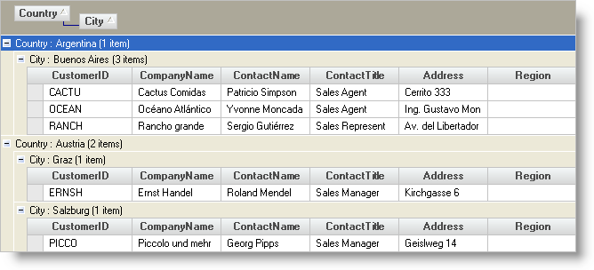

////

|metadata|
{
    "name": "wingrid-expanding-all-rows-in-wingrid",
    "controlName": ["WinGrid"],
    "tags": ["Grids","How Do I","Layouts"],
    "guid": "{C40462B9-AB99-4ADC-BD88-B18519ED80B9}",  
    "buildFlags": [],
    "createdOn": "2005-11-07T00:00:00Z"
}
|metadata|
////

= Expanding All Rows in WinGrid

Use the  pick:[win-forms="link:{ApiPlatform}win.ultrawingrid{ApiVersion}~infragistics.win.ultrawingrid.ultragridrow~expandall.html[ExpandAll]"]  method to expand all the rows in the grid. This could be useful if you have the WinGrid™ set to OutlookGroupBy mode, and have it sorted by predefined columns. You can use the ExpandAll to expand all the rows in each group. The follow code demonstrates this idea.

*In Visual Basic:*

----
Imports Infragistics.Win.UltraWinGrid
...
Private Sub Expand_All_Rows_in_WinGrid_Load(ByVal sender As System.Object, _
  ByVal e As System.EventArgs) Handles MyBase.Load
	Me.UltraGrid1.DisplayLayout.ViewStyleBand = ViewStyleBand.OutlookGroupBy
	Me.UltraGrid1.DisplayLayout.Bands(0).SortedColumns.Add("Country", False, True)
	Me.UltraGrid1.DisplayLayout.Bands(0).SortedColumns.Add("City", False, True)
	Me.UltraGrid1.Rows.ExpandAll(True)
End Sub
----

*In C#:*

----
using Infragistics.Win.UltraWinGrid;
...
private void Expand_All_Rows_in_WinGrid_Load(object sender, EventArgs e)
{
	this.ultraGrid1.DisplayLayout.ViewStyleBand = ViewStyleBand.OutlookGroupBy;
	this.ultraGrid1.DisplayLayout.Bands[0].SortedColumns.Add("Country", false, true);
	this.ultraGrid1.DisplayLayout.Bands[0].SortedColumns.Add("City", false, true);
	this.ultraGrid1.Rows.ExpandAll(true);
}
----

