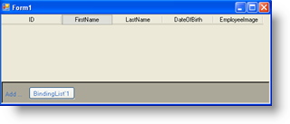

////

|metadata|
{
    "name": "wingrid-generic-lists",
    "controlName": ["WinGrid"],
    "tags": ["Application Scenarios","Grids","Sample Data Source"],
    "guid": "{3ED86426-E16B-4EC4-B7F2-C42D87B55A4B}",  
    "buildFlags": [],
    "createdOn": "0001-01-01T00:00:00Z"
}
|metadata|
////

= Generic Lists

The .NET Framework 2.0 features support for Generics. System.ComponentModel.BindingList is a Generic collection that allows you to specify a Type and provides the built in support for complex data binding normally found in the traditional IBindingList implementations. Implementing a BindingList of your custom objects is very simple to implement and easy to maintain.

The following example code shows the creation of a Generic BindingList of type Customer which is bound to WinGrid™:

*In Visual Basic:*

----
Private Sub Form1_Load( _
   ByVal sender As System.Object, _
   ByVal e As System.EventArgs) Handles MyBase.Load
   Dim theEmployeeList As BindingList(Of Employee) = _
      New BindingList(Of Employee)
   Me.UltraGrid1.DataSource = theEmployeeList
End Sub
----

*In C#:*

----
private void Form1_Load(object sender, EventArgs e)
{
   BindingList theEmployeeList = 
      new BindingList<employee>();
   this.ultraGrid1.DataSource = theEmployeeList;
}
----

The result is shown in the following image. The schema has been created within the WinGrid and since the properties for Row Adding are set, we also see the AddNewBox element with one button that represents the Entity type contained within the BindingList.

The Benefit of using a Generic BindingList is that you simply need to focus on creating your Business Classes. Creating a BindingList of your Class types allows you to inherit from existing functionality which includes adding, deleting and binding notifications that will be used behind the scenes by any data bound control such as the WinGrid. In other words, you can use the WinGrid’s built in features to add or delete rows and whatever action you perform through the WinGrid will act directly upon the underlying BindingList. If you delete a Row from the WinGrid, the corresponding object will be removed from the underlying list, if you add a Row through the WinGrid, the underlying list will also have a new member added to its collection.

Using other kinds of list implementations such as a standard array of type Customer will not allow the addition or removal of rows, because a standard array is not mutable.